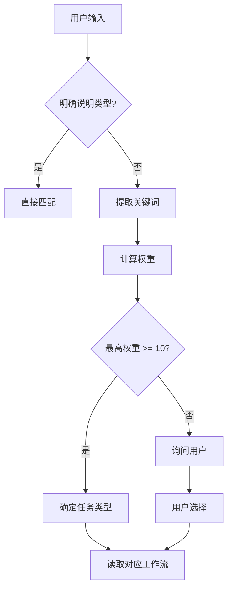

# 任务识别规则详解

> 本文档详细说明 AI 如何识别用户输入的任务类型
>
> **v2.12.0 重构**：识别流程从 2 层+补丁 升级为 4 层流程，新增 Layer 3 意图推断，解决关键词映射无法穷举表达方式的根因问题

---

## 🎯 识别流程（4 层递进）

```
Layer 1: 精确匹配    — 用户明确声明 → 直接采用
    ↓ 未声明
Layer 2: 关键词信号  — 提取关键词 → 产出候选类型（可能多个）
    ↓ 候选列表
Layer 3: 意图推断    — 分析最终目的 → 确定唯一类型（🔴 核心判断层）
    ↓ 判定结果
Layer 4: 上下文校验  — 结合会话/项目上下文 → 确认或修正
```

---

### Layer 1: 精确匹配（最高优先级）

如果用户明确说明任务类型，直接匹配：
- "这是一个需求" → 需求开发
- "这是一个 Bug" → Bug 修复
- "需要优化性能" → 性能优化

---

### Layer 2: 关键词信号提取

> ⚠️ **定位**：Layer 2 的输出是**候选类型列表**，不是最终判定。最终判定由 Layer 3 意图推断决定。

根据关键词权重提取候选信号：

#### 需求开发关键词（权重表）
| 关键词 | 权重 | 示例 |
|--------|------|------|
| 实现、开发、添加 | 10 | "实现用户注册功能" |
| 集成、对接、接入 | 10 | "集成第三方支付" |
| 新功能、新特性 | 9 | "添加新功能" |
| 支持、扩展 | 8 | "支持多语言" |

#### Bug 修复关键词（权重表）
| 关键词 | 权重 | 示例 |
|--------|------|------|
| 修复、解决 | 10 | "修复登录问题" |
| Bug、问题、错误 | 10 | "有个 Bug 需要处理" |
| 报错、异常、崩溃 | 9 | "接口报错" |
| 不工作、失败 | 8 | "支付不工作" |

#### 性能优化关键词（权重表）
| 关键词 | 权重 | 示例 |
|--------|------|------|
| 优化、提升、加速 | 10 | "优化查询速度" |
| 慢、卡顿、延迟 | 10 | "接口太慢了" |
| 性能、效率 | 9 | "提升性能" |
| 降低、减少（资源） | 8 | "降低内存占用" |

> 💡 Layer 2 仅提取信号。当关键词冲突或存在"分析"+"变更"混合信号时，**必须进入 Layer 3 意图推断**才能判定。

---

### 🔴 Layer 3: 意图推断（核心判断层）

> **设计原则**：判断用户的**最终目的**，而不是匹配表面关键词。
> 关键词列表永远无法穷举所有表达方式，但意图推断可以。
>
> **历史背景**：v2.12.0 前此层逻辑以"混合意图规则 FIX-010"补丁形式存在，依赖关键词列表近似模拟意图推断，
> 导致 issue#2（2026-03-03）和 issue#11（2026-03-05）两次误判事故。v2.13.0 将其升级为正式识别层级。

#### 三个判断问题（按顺序执行）

```yaml
🔴 Q1 — 最终目的是什么？（最关键）

  用户最终想达成的结果是：
    A. 产出代码/文件/配置的实质性变更 → 变更类工作流（需求开发/Bug修复/重构/数据库/安全...）
    B. 获得分析结论/评估报告/调研结果 → 分析类工作流（深度分析/技术调研）
    C. 获得知识/解答/解释 → 简单问答
    D. 回顾事故经过和教训 → 事故复盘

🔴 Q2 — "分析/评估/审查"是手段还是目的？

  如果请求中包含"分析/评估/审查"类词语：
    手段: 分析是为了后续变更服务（前置步骤）→ 变更类工作流
    目的: 分析本身就是最终交付物 → 分析类工作流
  
  判断方法: 如果去掉"分析"部分，请求仍然有明确的变更诉求 → 分析是手段

🔴 Q3 — 是否描述了具体要执行的事项？

  是: 请求中列举了具体的需求项、变更项、实现目标（编号列表、"需求如下"、"功能如下"）→ 变更类工作流
  否: 只描述了想了解/评估/检查的内容，无具体执行事项 → 分析类工作流
```

#### 判定规则

```yaml
变更类（Q1=A 或 Q2=手段 或 Q3=是，任一成立）:
  → 根据 Layer 2 候选信号选择具体变更工作流（需求开发/Bug修复/重构...）
  → 如果 Layer 2 无明确候选 → 默认需求开发（01-requirement-dev）
  → 必须走对应确认点流程（CP1→CP2→CP3）

分析类（Q1=B 且 Q2=目的 且 Q3=否，三者同时成立）:
  → 深度分析（10-analysis）或技术调研（04-research）
  → 仅当用户全文不含任何变更诉求时才走此路径
```

#### 示例（用三问验证）

| 用户输入 | Q1 最终目的 | Q2 分析是… | Q3 具体事项 | 判定 |
|---------|:---:|:---:|:---:|------|
| "分析目录结构合理性并给重构方案" | 重构(变更) | 手段 | 有(重构) | ✅ 需求开发 |
| "分析chat项目…需求如下 1、添加字段 2、支持…" | 开发(变更) | 手段 | 有(编号列表) | ✅ 需求开发 |
| "分析下方案合理性然后调整" | 调整(变更) | 手段 | 有(调整) | ✅ 需求开发 |
| "帮我看看这个接口为什么报错然后修一下" | 修复(变更) | 手段 | 有(修复) | ✅ Bug 修复 |
| "分析这个项目架构质量" | 获得结论 | 目的 | 无 | ✅ 深度分析 |
| "评估当前规范健康度" | 获得结论 | 目的 | 无 | ✅ 深度分析 |
| "对比 Redis 和 Memcached" | 获得结论 | 目的 | 无 | ✅ 技术调研 |
| "MongoDB 的索引原理是什么" | 获取知识 | N/A | 无 | ✅ 简单问答 |

#### 与 FIX-010 的关系

```yaml
FIX-010 历史追溯:
  FIX-010（2026-02-28）是 Layer 3 的前身，以"混合意图关键词列表"补丁形式存在于 v2.12.0。
  其核心逻辑"分析只是变更的前置步骤→走需求开发"已被 Layer 3 的 Q2 自然覆盖。
  FIX-010 编号保留用于历史追溯（issue#2、issue#11），但不再作为独立规则存在。
  
  根因回顾:
    issue#2 (2026-03-03) — 首次发现，AI 将含变更意图的请求误判为分析
    issue#11 (2026-03-05) — 复发，关键词列表不完整导致遗漏
    v2.12.0 — 根因修复，用意图推断替代关键词穷举
```

---

### Layer 4: 上下文校验

Layer 3 判定结果出来后，结合以下上下文信息进行确认或修正：

```yaml
校验项:
  1. 会话上下文: 当前会话中之前的任务是什么？是否有未完成的上下文延续？
  2. 项目状态: 项目是否有 实施计划？当前进度是什么？
  3. 用户历史: 用户在之前的对话中是否表达过相关意图？

修正规则:
  - Layer 4 可以修正 Layer 3 的判定，但必须说明修正理由
  - 如果 Layer 4 仍然不确定 → 向用户询问确认
```

---

## 🔍 模糊场景判断规则（Layer 2 + Layer 3 协同）

### 场景 1: 同时包含多个关键词
```
用户输入: "修复支付接口的性能问题"
关键词: 修复(Bug) + 性能(优化)

判断逻辑:
1. 计算权重: Bug=10, 优化=10
2. 看上下文: "修复...问题" → Bug 修复优先
3. 最终判断: Bug 修复
```

### 场景 2: 关键词不明确
```
用户输入: "用户登录有点慢"
关键词: 慢(优化=10)

判断逻辑:
1. 没有明确说"Bug"或"需求"
2. "慢"是性能问题的直接表述
3. 最终判断: 性能优化
```

### 场景 3: 系统对接场景
```
用户输入: "对接第三方支付 API"
关键词: 对接(需求=10)

判断逻辑:
1. "对接"属于需求开发的子场景
2. 不是独立任务类型
3. 最终判断: 需求开发（会生成对接文档）
```

### 场景 4: API 接口开发/变更场景
```
用户输入: "新增一个获取用户积分的接口"
关键词: 新增(需求=10), 接口(需求=8)

判断逻辑:
1. "新增"属于需求开发
2. "接口"表明涉及 API 端点新增/变更
3. 最终判断: 需求开发（标记需生成接口文档）
```

```
用户输入: "修改用户列表接口，增加分页参数"
关键词: 修改(需求=10), 接口(需求=8)

判断逻辑:
1. "修改"+"接口" 表明对已有 API 接口契约的变更
2. 不是 Bug（用户没说"错误/问题"）
3. 最终判断: 需求开发（标记需生成接口文档）
```

```yaml
🔴 接口文档生成标记规则:

  当识别到以下信号时，任务应标记"需生成接口文档":
    - 用户请求包含"接口"+"新增/添加/开发/实现"
    - 用户请求包含"接口"+"修改/调整/变更"
    - 用户请求包含"API"+"开发/设计/新增"
    - 用户请求包含"对接"（第三方系统对接）
    - 用户请求包含"端点/endpoint"相关描述

  标记后的行为:
    需求开发 → 按 01-requirement-dev 执行，完成后生成 04-接口文档.md
    Bug 修复 → 按 02-bug-fix 执行，若修复涉及接口契约变更则生成 04-接口变更.md

  不标记的场景:
    - 纯内部逻辑修改（"优化查询逻辑"，不涉及接口契约）
    - 纯前端修改（"修改页面样式"）
    - 仅数据库变更（"添加索引"，不影响接口响应）
```

---

## 🚨 边缘情况处理

### 情况 1: 无法判断
如果无法确定任务类型：
```
AI 输出:
"我不确定这是哪种任务类型，请明确说明：
- 🎯 需求开发 - 新功能或集成
- 🐛 Bug 修复 - 修复问题
- ⚡ 性能优化 - 提升性能
- 📋 技术调研 - 技术选型
- 其他（请描述）"
```

### 情况 2: 多任务组合
如果用户一次提出多个任务：
```
用户: "实现限流功能，并修复登录 Bug"

AI 输出:
"检测到 2 个任务：
1. 需求开发: 实现限流功能
2. Bug 修复: 修复登录 Bug

我将按顺序处理，请确认优先级。"
```

### 情况 3: 任务类型转换
如果任务执行中发现类型错误：
```
初始判断: 需求开发
执行过程中: 发现是已有功能的 Bug

AI 行为:
1. 向用户报告: "这似乎是 Bug 修复而非新需求"
2. 确认后切换到 Bug 修复工作流
3. 重新生成文档
```

---

## 📊 决策树算法



---

## 🧪 测试用例

### 用例 1: 需求开发
```
输入: "在 user 服务添加限流中间件"
期望: 需求开发 → 01-requirement-dev
实际: ✅ 正确识别
```

### 用例 2: Bug 修复
```
输入: "登录接口返回 500 错误"
期望: Bug 修复 → 02-bug-fix
实际: ✅ 正确识别
```

### 用例 3: 性能优化
```
输入: "查询用户列表太慢，需要优化"
期望: 性能优化 → 03-optimization
实际: ✅ 正确识别
```

### 用例 4: 系统对接（边缘情况）
```
输入: "对接微信支付 API"
期望: 需求开发（含对接文档）→ 01-requirement-dev
实际: ✅ 正确识别
```

### 用例 5: 模糊输入
```
输入: "用户认证有问题"
分析: "问题"可能是 Bug 或需求不明确
期望: 询问用户具体情况
实际: ✅ 正确处理
```

---

## 🔧 AI 实现参考

```typescript
interface TaskIdentification {
  type: 'requirement' | 'bug' | 'optimization' | 'research' | 'refactoring' | 'database' | 'security' | 'incident' | 'analysis' | 'self_audit';
  confidence: number; // 0-100
  keywords: string[];           // Layer 2 提取的关键词信号
  intentReasoning: string;      // Layer 3 意图推断理由
  workflow: string;
}

function identifyTask(userInput: string, context?: SessionContext): TaskIdentification {
  // Layer 1: 精确匹配
  const explicitType = matchExplicitDeclaration(userInput);
  if (explicitType) return explicitType;

  // Layer 2: 关键词信号提取（候选列表）
  const keywords = extractKeywords(userInput);
  const candidates = getCandidateTypes(keywords);

  // Layer 3: 意图推断（核心判断）
  const intent = analyzeIntent(userInput, {
    q1_finalPurpose: determineFinalPurpose(userInput),    // 变更/结论/知识/复盘
    q2_analysisRole: isAnalysisMeansOrEnd(userInput),     // 手段/目的
    q3_hasActionItems: hasConcreteActionItems(userInput),  // 是/否
  });

  // Layer 4: 上下文校验
  const finalType = validateWithContext(intent, candidates, context);

  return {
    type: finalType.type,
    confidence: finalType.confidence,
    keywords,
    intentReasoning: intent.reasoning,
    workflow: getWorkflowPath(finalType.type)
  };
}
```

---

## 📝 识别日志模板

AI 识别任务后应输出：
```
✅ 任务识别完成

任务类型: 需求开发
工作流文件: core/workflows/01-requirement-dev/README.md
置信度: 95%
关键词信号: ["实现", "限流", "集成"]
意图推断: 用户最终目的是添加限流功能（代码变更），分析是前置步骤 → 需求开发

下一步: 读取需求开发工作流并执行...
```

> 💡 `意图推断` 字段是 v2.12.0 新增，用于记录 Layer 3 的判断理由，便于事后审计和纠错。
