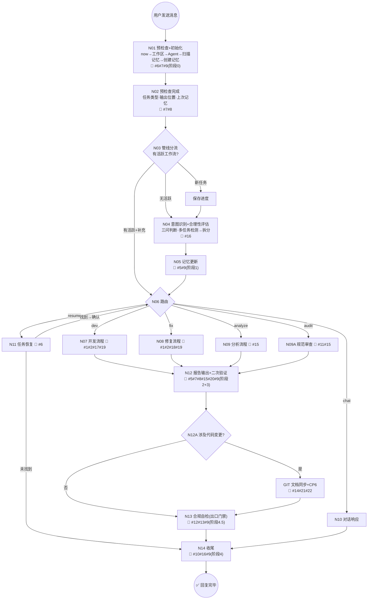

# v3 核心规范

> AI 执行任务时的唯一权威规范入口。会话开始时全文读取，后续节点不重复读。

**版本**: v3.0.0
**最后更新**: 2026-03-12

---

## 主线流程图



> **⚡ 贯穿式约束（全流程生效）**: 🔴#10 Token防护 · 🔴#9 消息驱动5+1阶段 · 🔴#6 Agent目录隔离 · 🔴#4 输出中文
> **📏 节点标注**: `#N` = 触发的约束编号，对应 §4 的 22 条约束

---

## §1 消息管线

### N01 预检查+初始化（🔴 完成前禁止任何分析性读取）

**前三步必须严格按序执行（具体工具名因客户端而异，按意图选择对应工具）：**

| 步骤 | 动作 | 说明 |
|:----:|------|------|
| ① | 获取当前时间 | 🔴禁止编造或跳过，降级优先级见下表 |
| ② | 逐层列出 `projects/<project>/.ai-memory/clients/<agent>/tasks/` 目录内容 | 扫描记忆目录（🔴禁止 glob/find） |
| ③ | 创建或编辑记忆文件 | 创建/追加 `YYYYMMDD.md §会话NN` — 🔴**阶段0硬性阻塞** |

**步骤①时间获取降级表：**

| 优先级 | 方式 | 适用条件 |
|:------:|------|---------|
| 1 | 系统上下文注入的日期元数据 | 客户端在系统提示中注入了当前日期（如 `The current date is...`） |
| 2 | `now()` | 原生工具可用时 |
| 3 | `run_in_terminal("Get-Date -Format 'yyyy-MM-dd HH:mm:ss'")` | PowerShell 环境 |
| 4 | `run_in_terminal("date '+%Y-%m-%d %H:%M:%S'")` | Bash/Zsh 环境 |
| ❌ | 编造日期 / 使用 YYYY-MM-DD 占位符 / 跳过步骤 | 🔴**任何情况下禁止** |

> ❌ 读取 RULES.md 不得作为前三步之一（copilot-instructions.md 已提供最小规则集，RULES.md 全文在前三步完成后读取）

**步骤 ④~⑧ 在前三个 tool call 完成后执行：**

| 步骤 | 内容 | 输出 |
|:----:|------|------|
| ④ | 识别工作区 → 确定 `<project>` | 项目名 |
| ⑤ | 检测 Agent 标识 → 确定 `<agent>` | Agent ID（详见 §8） |
| ⑥ | 任务类型（初步判断） | dev/fix/analyze/audit/chat |
| ⑦ | 输出位置（构建两条路径） | 产物路径 + 报告路径；🔴构建后必须对照 §7 目录树验证：①根 = `projects/<project>/`？②一级目录 ∈ {requirements/bugs/optimizations/reports/.ai-memory}？③`<中文描述>` 描述本任务目标？ |
| ⑧ | 上次记忆状态 | 🔄/✅/⚠️无 |

### N02 预检查完成

输出预检查摘要（6 行格式）：

```text
📋 预检查:
1. 工作区: [项目路径]
2. 任务类型: [类型]
3. 输出位置: [产物路径 + 报告路径]
4. Agent: [agent-id]
5. 上次记忆: [路径 §会话NN + 状态] 或 [⚠️ 无]
6. 📝 记忆已创建: [路径 §会话NN (🔄)]
```

### N03 管线分流

| 条件 | 行为 |
|------|------|
| 无活跃工作流 | → N04（完整管线） |
| 有活跃工作流 + 用户消息是补充/修正 | → N06 直接路由（简化管线） |
| 有活跃工作流 + 用户消息是新任务 | → 保存当前进度 → N04 |

### N10 对话模式

| 项 | 规则 |
|----|------|
| 豁免 | 验证列 ❌ · 报告 ❌ · 归档文档 ❌ |
| 不豁免 | 记忆 ✅ · Token 检查 ✅ · 中文输出 ✅ |

---

## §2 意图识别

### 三问判断法（N04）

| 问题 | 指向变更 | 指向分析 |
|------|---------|---------|
| Q1: 最终目的是产生代码/配置变更，还是获得结论/报告？ | 变更 | 结论 |
| Q2: 分析是手段（为了改代码）还是目的（为了得出结论）？ | 手段 | 目的 |
| Q3: 是否有具体的代码执行事项？ | 是 | 否 |

> 🔴 任一问题指向变更 → `dev` 或 `fix`；三问全部指向分析才走 `analyze`

**边界示例：**

| 用户消息 | Q1 | Q2 | Q3 | 结论 |
|---------|:--:|:--:|:--:|------|
| "分析一下这个代码然后修复" | 变更 | 手段 | 是 | → `fix`（分析是修复的前置步骤） |
| "帮我看看这段代码有没有问题" | 结论 | 目的 | 否 | → `analyze`（只看不改） |
| "深度分析规范文件，找出问题" | 结论 | 目的 | 否 | → `audit`（对象是规范文件，非项目代码） |
| "检查并修复规范中的不一致" | 变更 | 手段 | 是 | → `fix`（最终要改文件） |

> ⚠️ **analyze vs audit 区分**：对象是项目代码 → `analyze`；对象是规范文件（ai-dev-guidelines） → `audit`

### 意图类型

| 意图 | 触发关键词（辅助，不依赖） | 路由目标 |
|------|--------------------------|---------|
| `dev` | 实现、开发、添加、新增、重构、优化 | N07 |
| `fix` | 修复、Bug、报错、异常 | N08 |
| `analyze` | 分析、审查、评估、对比 | N09 |
| `audit` | 规范审查、健康检查、spec audit | N09A |
| `chat` | 问答、解释、帮助 | N10 |
| `resume` | 继续、恢复 | N11 |

### 多任务检测与拆分

检测到用户消息包含多个独立任务时：
1. 列出识别到的各任务
2. 建议拆分为顺序执行
3. 用户不同意 → 按用户指定顺序

### 合理性评估（约束 #16）

- 收到需求后先评估合理性，**有更好建议先提出，等用户确认后再执行**
- 明显不合理 → 说明原因 + 替代方案
- 🔴 后续建议**必须在对话中直接输出摘要**（标题+一句话+收益），禁止仅写入报告

---

## §3 确认点

### CP 总览

| CP | 时机 | 性质 | 适用工作流 | 确认后唯一合法下一步 |
|:--:|------|:----:|:--------:|-------------------|
| CP1 | 需求理解后 | 🔴强制 | build · fix | 生成技术方案 → 等待 CP2 |
| CP2 | 技术方案后 | 🔴强制 | build · fix | build: 生成实施方案+IMPL-PLAN → 等待 CP3 · fix: 🟢 直接执行修复 |
| CP3 | 实施方案后 | 🔴强制 | build | 🟢 **代码执行授权** — 按方案逐文件执行 |
| CP4 | 测试完成后 | 按需 | build · fix | 进入文档生成 |
| CP5 | 文档生成后 | 按需 | build · fix | 完成任务 |
| CP6 | 文档同步后 | 按需 | build · fix | 完成任务（涉及代码变更时触发） |

> ⚠️ fix 工作流不经过 CP3：CP2 确认后直接执行修复（修复通常是小范围精确变更）。如果修复涉及大范围改动（≥5 文件），建议切换到 `dev` 工作流。

### 🔴 CP 强制规则

| 规则 | 说明 |
|------|------|
| 禁止跳过 | 每个 CP 必须执行，不得省略 |
| 禁止合并 | 一次确认只确认当前 CP |
| 禁止跳跃 | CP 确认后只能做下一个规定动作 |
| CP2≠CP3 | 🔴 CP2 确认 = 认可技术方案，**不等于代码执行授权**（FIX-015） |

### IP 询问点

| IP | 时机 | 目的 |
|:--:|------|------|
| IP1 | CP3 之后 | 选择测试产物（单元测试/HTTP测试/OpenAPI/全部/跳过） |
| IP2 | CP4 之后 | 选择文档产物（README/CHANGELOG/脚本文档/API文档/全部/跳过） |

> 📎 CP 完整定义与输出格式：`workflows/common/confirmation-points.md`

---

## §4 核心约束（22 条）

> 🔴P0 = 违反即事故 · 🟡P1 = 必须执行 · 💡P2 = 推荐执行（预留，暂无条目）

### 🔴 P0（13 条）

| # | 约束 | 一句话定义 |
|:-:|------|----------|
| 1 | 修改/删除需确认 | 修改或删除文件前输出变更计划等待确认（豁免：记忆/报告自动写入 · self-fix 安全类修复） |
| 2 | CP 不可跳过 | CP1→CP2→CP3 严格顺序，禁止合并/跳跃；CP2≠代码授权（FIX-015） |
| 3 | 禁止硬编码敏感信息 | API Key/密码/Token 不得出现在代码中 |
| 4 | 输出中文 | 所有对话/报告/记忆使用中文，技术术语可保留英文 |
| 5 | 记忆+报告自动写入 | 自动写入记忆和报告，**绝不询问用户** |
| 6 | Agent 目录隔离 | 不同 Agent 的记忆和报告在各自目录中，不互相写入 |
| 7 | 文件名日期+序号规则 | 报告 `NN-<类型>-<简述>.md` 在 `<agent>/YYYYMMDD/` 下；记忆 `YYYYMMDD.md` |
| 8 | 报告/记忆序号独立 | 报告 NN 仅扫描 `reports/<子目录>/<agent>/YYYYMMDD/`；记忆无 NN |
| 9 | 消息驱动记忆触发 | 5+1 阶段（0初始化→1用户消息→2+3回复→4.5合规→4结束） |
| 10 | Token 耗尽防护 | 70%预警(自动检查点) · 85%防护(自动写记忆) · ≥15轮+≥5文件硬性兜底（详见 §9） |
| 11 | 规范修改需交叉验证 | 修改规范文件后逐个检查引用处一致性 |
| 12 | 任务完成验证 | 声称完成前 5 项验证：文件存在+结构完整+记忆更新+关联一致+文档产物 |
| 13 | 回复自检+自修复 | N13 双层检查（FC1~5 + SC1~5），不通过则自动修复（详见 §11） |

### 🟡 P1（9 条）

| # | 约束 | 一句话定义 |
|:-:|------|----------|
| 14 | Git 操作需确认 | commit/push 前输出计划等待确认；Conventional Commits 格式 |
| 15 | 输出需验证 | 每条问题/建议/方案附带合理性+可实施性+收益三项验证 |
| 16 | 主动合理性分析 | 有更好建议先提出；后续建议必须在对话中直接输出摘要 |
| 17 | 关联文件检查 | 修改/新建/重命名文件后检查所有引用并同步 |
| 18 | 修复需扫描 | 三步：同类全局扫描→数据联动扫描→grep 零残留复核 |
| 19 | 编码后诊断 | 代码修改后运行 `diagnostics`，error 立即修复（最多 2 次） |
| 20 | 文件过大必须拆分 | AI 新建 .md 超 500 行必须拆分（已有文件豁免） |
| 21 | Git 提交规范 | `<type>(<scope>): <description>`；涉及源码变更时主动触发 |
| 22 | 文档同步 | 涉及代码变更时检查 STATUS/CHANGELOG/TASK-INDEX，CP6 确认 |

---

## §5 记忆规则

### 消息驱动 5+1 阶段

| 阶段 | 触发时机 | 执行内容 | 对应节点 |
|:----:|---------|---------|:--------:|
| 0 | 首条消息（入口门禁） | 预检查 + 创建/追加 `YYYYMMDD.md` | N01 |
| 1 | 用户发消息 | 捕获意图/需求/修正（纯确认不触发） | N05 |
| 2 | AI 回复 | 写报告 + 更新记忆 + 追加对话记录 | N12 |
| 3 | AI 执行完毕 | 记录变更清单（通常与阶段 2 合并） | N12 |
| 4.5 | 任务结束前（出口门禁） | 合规性回溯检查 | N13 |
| 4 | 任务结束 | 终态更新（状态→✅） + 后续建议 | N14 |

> 典型顺序：0 → 1 → 2+3 → 1 → 2+3 → … → 4.5 → 4

### 记忆文件结构

```text
.ai-memory/clients/<agent>/tasks/YYYYMMDD.md
```

- 每天一个文件，无 NN 序号
- 文件内以 `## 会话 NN` 分段
- 已存在 → 读取已有会话数 → 追加 `## 会话 NN+1`
- 不存在 → 创建，写入 `## 会话 01`

### 必含字段

每个会话段落必须包含：`🎯 任务摘要` · `📄 关联报告`（表格+链接） · `💡 关键决策` · `⚠️ 待跟进` · `📨 对话记录`（4列表格：轮次|方向|摘要|关联）

### 对话记录关联标记

`📋` 项目规范 · `📄` 报告文件 · `🧠` 记忆文件 · `📑` 规范文件

### 编码检查点（变更 ≥3 文件时触发）

- 有 IMPLEMENTATION-PLAN → 按任务编号写入检查点
- 无 IMPLEMENTATION-PLAN → 每 3 文件写入 📦 检查点

### N11 任务恢复

1. 读 `clients/<agent>/tasks/` 下最新日期文件
2. 找最后一个 🔄 状态会话
3. 读📨对话记录 → 跟链接读报告 → 恢复上下文
4. 从中断的 CP 继续（不重来已确认 CP）
5. 多个 🔄 → 列表展示让用户选择

---

## §6 报告规则

### 报告文件位置与命名

```text
reports/<子目录>/<agent>/YYYYMMDD/NN-<类型>-<简述>.md
```

- `NN` 仅扫描 `reports/<子目录>/<agent>/YYYYMMDD/` 目录取 `max+1`（与记忆无关）
- 子目录：`analysis/` · `diagnostics/` · `bugs/` · `requirements/` · `optimizations/`

### 🔴 报告头部必填

```markdown
# [标题]

> **项目**: [真实项目名]
> **类型**: [类型]
> **创建日期**: YYYY-MM-DD ← 必须替换为真实日期
> **Agent**: [agent-id]
> **状态**: 📝 进行中 / ✅ 已完成
```

### 🔴 报告正文约束（约束 #15 落地）

报告中每条问题/建议/方案/行动项，**必须**附带三列：

| 列 | 检查内容 |
|----|---------|
| 合理性 | 是否真实存在？基于实际文件验证还是推断？ |
| 可实施性 | AI 或用户能否落地执行？已验证还是待验证？ |
| 收益/必要性 | 修复/采纳后的具体收益是什么？ |

### N12 四步闭环

1. 写入报告文件
2. 二次验证：回读报告 → 逐条核实问题真实性 → 标注验证状态
3. 打开报告文件 — 自动打开（🔴不询问，直接调用；如客户端不支持自动打开，输出文件路径让用户手动打开）
4. 更新记忆文件 → 追加报告链接

### 🔴 报告自检清单（写入前逐项确认）

- [ ] 存放在 `reports/<子目录>/<agent>/YYYYMMDD/` 目录下？
- [ ] 文件名以 `NN-` 开头（2 位序号）？
- [ ] 头部「创建日期」已替换为真实日期？
- [ ] 头部「Agent」已标识？
- [ ] 正文问题/建议表格包含「合理性+可实施性+收益」列？
- [ ] 执行中完成的问题项已实时标 ✅？
- [ ] 任务完成时头部状态已更新为 ✅？

---

## §7 输出路径

> 🔴 所有路径以 `projects/<project>/` 为根，禁止写入项目源码目录
> 🔴 禁止在 `projects/<project>/` 下创建下方目录树之外的一级目录

```text
projects/<project>/
├── requirements/<中文描述>/          # 需求产物（dev 默认）
│   ├── 01-需求定义.md
│   ├── 02-技术方案.md
│   ├── 03-实施方案/
│   ├── IMPLEMENTATION-PLAN.md       # 🔴 强制
│   └── scripts/                     # 辅助脚本（如有）
├── bugs/<中文描述>/                  # Bug 修复产物（fix）
│   ├── 01-需求定义.md
│   ├── 02-技术方案.md
│   ├── 03-实施方案/
│   └── IMPLEMENTATION-PLAN.md       # 🔴 ≥5 文件时强制
├── optimizations/<中文描述>/         # 优化产物（dev > 性能优化）
│   ├── 01-需求定义.md
│   ├── 02-技术方案.md
│   ├── 03-实施方案/
│   ├── IMPLEMENTATION-PLAN.md       # 🔴 强制
│   └── scripts/                     # 测试/压测脚本（如有）
├── reports/<子目录>/<agent>/YYYYMMDD/ # 报告
├── .ai-memory/clients/<agent>/tasks/ # 记忆
├── profile/                          # 项目规范（项目上下文）
│   └── README.md
├── TASK-INDEX.md                     # 任务索引（约束 #22 引用）
└── README.md                        # 项目说明
```

### 🔴 产物目录规则

| 规则 | 说明 |
|------|------|
| 目录命名 | `<中文描述>` 必须描述本任务的目标，禁止复用其他任务的目录 |
| 任务隔离 | 每个 `<中文描述>/` 目录只服务一个明确任务，禁止混放不同任务的产物 |
| 禁止非规范路径 | `projects/<project>/` 下只允许上述目录树中的一级目录 |
| 文件清理 | 产物位置迁移时，必须删除旧位置文件并在记忆中标注迁移记录 |

---

## §8 Agent 协同

### Agent 标识检测（优先级从高到低）

**第一优先：结构特征检测**

| 特征 | 结论 |
|------|------|
| 系统提示含 `## System Information` + `## Model Information` | 编辑器 = Zed |
| 用户消息含 `[@文件名](file:///...)` 或 `zed:///` | 编辑器 = Zed |
| 系统提示含 `<environment_info>` + `JetBrains` | 编辑器 = WebStorm（JetBrains IDE） |
| `.github/copilot-instructions.md` 被注入系统提示 | Service = Copilot |
| `.clinerules` 被注入系统提示 | Service = Cline |
| `CLAUDE.md` 被注入系统提示 | Service = Claude Code |

**编辑器 + Service 合并映射表：**

| 编辑器 | Service | 标识值 |
|--------|---------|--------|
| Zed | Copilot | `zed-copilot` |
| VSCode | Copilot | `vscode-copilot` |
| WebStorm (JetBrains) | Copilot | `webstorm-copilot` |
| Cursor | — | `cursor` |
| 未知 | 未知 | `unknown-agent` |

**第二优先：关键字兜底** — 系统提示含 "JetBrains"→`webstorm-copilot` / "Cursor"→`cursor` / "VS Code"→`vscode-copilot` 等

**🔴 无法确定时必须使用 `unknown-agent` 并立即提示用户确认，禁止猜测**

### 隔离规则

- **写入**：只写 `clients/<当前agent>/`
- **读取**：先读全局 `SUMMARY.md`，再读本 Agent 目录
- **禁止**：写入其他 Agent 的 `clients/` 目录
- **恢复**：只从本 Agent 目录查找 🔄 任务

---

## §9 Token 管理

### 估算规则

| 内容类型 | 估算 |
|---------|------|
| 中文文本 | 1 字 ≈ 2 tokens |
| 英文文本 | 1 词 ≈ 1.5 tokens |
| 代码 | 1 行 ≈ 10 tokens |

### 三级防护

| 级别 | 阈值 | 行为 |
|:----:|------|------|
| 🟡预警 | ~70% | `📊 Token: ~NNk/上限 (NN%)` — **自动写编码检查点** · 进入节约模式 · 通知用户 |
| 🔴防护 | ~85% | 立即写完整记忆 · 停止大型读写 · 建议开新会话 |
| 🔴硬性 | ≥15轮 且 ≥5文件待改 | 强制触发防护（无需精确估算） |

### 启发式辅助（无法精确估算时）

> 1 轮 = 1 次用户消息 + 1 次 AI 回复

- 对话超 10 轮 → 进入关注区
- 已读/写文件总行数超 3000 → 加密检查点
- 单次回复超 2000 字 → 检查剩余容量

---

## §10 工作流路由表

### N06 路由映射

| 意图 | 工作流文件 | 说明 |
|------|----------|------|
| `dev` | `workflows/build/README.md` | 4 阶段 · CP1→CP2→CP3 · 编码检查点 |
| `fix` | `workflows/fix/README.md` | 3 阶段 · CP1→CP2 · 修复后三步扫描 |
| `analyze` | `workflows/analyze/README.md` | 4 阶段 · 🔴禁止修改代码 · 三项验证 |
| `audit` | `workflows/audit/README.md` | 15 维度 · 衔接 self-fix · 交叉验证 |
| `chat` | §1 N10 | 对话模式（记忆✅ 报告❌） |
| `resume` | §5 N11 | 任务恢复 |

### dev 子类型

| 子类型 | 变体 checklist |
|--------|---------------|
| 新需求 | — （默认流程） |
| 重构 | `checklist-refactor.md` |
| 数据库 | `checklist-database.md` |
| 项目初始化 | `checklist-init.md` |
| 性能优化 | `checklist-optimization.md` |

### fix 子类型

| 子类型 | 变体 checklist |
|--------|---------------|
| 常规 Bug | — （默认流程） |
| 事故处理 | `checklist-incident.md` |
| 安全修复 | `checklist-security.md` |

### analyze 子类型

| 子类型 | 变体 checklist |
|--------|---------------|
| 常规分析 | — （默认流程） |
| 技术调研 | `checklist-research.md` |

---

## §11 规范自修复

### 触发条件

| 触发源 | 说明 |
|--------|------|
| N13 合规检查不通过 | 自动修复 |
| 连续 2 次同类偏差 | 触发规范自检（升级分析） |
| audit 报告中 🔴 级问题 | 自动衔接修复 |
| AI 执行中发现规范冲突 | 随时触发（不需走 N09A） |
| 用户指出规范问题 | 识别意图 → 定位 → 修复建议 |

### N13 双层合规检查

**形式合规（FC）**

| # | 检查项 |
|:-:|--------|
| FC1 | 预检查 6 行格式完整？ |
| FC2 | 记忆文件已创建/追加？且必含字段齐全（🎯任务摘要 · 📄关联报告 · 💡关键决策 · ⚠️待跟进 · 📨对话记录）？ |
| FC3 | 报告文件已写入 + 自检清单通过 + 报告路径在记忆 📄 关联报告表格中已登记？ |
| FC4 | CP 按序执行且有用户明确响应？ |
| FC5 | 文件名/路径符合命名规范？ |

**实质合规（SC）**

| # | 检查项 |
|:-:|--------|
| SC1 | 报告中的问题/建议有验证列（合理性+可实施性+收益）？ |
| SC2 | 代码修改已运行 diagnostics 且无未处理 error？ |
| SC3 | 修复类任务已执行三步扫描？ |
| SC4 | 关联文件已检查并同步？ |
| SC5 | 后续建议已在对话中输出摘要（非仅报告中）？ |
| SC6 | 涉及 copilot-instructions.md 修改时，工作区和仓库两份副本是否已同步？ |

**恢复性检查（RC — 可选增强）**

> 非阻塞性检查：不通过时记录到报告的"待改进"章节，不阻塞回复。用于提升跨会话连续性。

| # | 检查项 |
|:-:|--------|
| RC1 | 如果从 N01 重新开始，当前记忆文件是否足以让下一个 Agent 恢复上下文？ |
| RC2 | 如果当前会话突然中断，已产出的文件是否自洽完整（不依赖未写入的后续步骤）？ |
| RC3 | 如果用户明天用不同 Agent 发送"继续"，当前 🔄 标记的任务是否提供了足够的恢复线索？ |
| RC4 | 如果上次会话（同 Agent/同项目）存在 ⚠️ 待跟进未完成项，本次是否已查阅并在记忆中关联处理（处理/转移/放弃+原因）？ |

### 修复分级

| 级别 | 适用场景 | 方式 |
|:----:|---------|------|
| 自动 | 安全类（数值同步、格式修正、缺失字段补充） | AI 直接修复 |
| 半自动 | 内容类（规范表述、流程调整） | 生成方案 → 用户确认 |
| 辅助 | 架构类（规范体系变更） | 生成指南 → 用户手动 |

### 任务完成验证（约束 #12）

声称完成前必须确认 5 项：

1. ✅ 输出文件存在且可读
2. ✅ 内容结构完整（头部字段+正文+验证列）
3. ✅ 记忆已更新（本次会话段落+报告链接）
4. ✅ 关联文件一致（修改的文件的引用处已同步）
5. ✅ 文档产物齐全（归档文档/报告/记忆三者闭环）

---

## 异常与降级

```text
正常模式（RULES.md + workflows + templates 全部可用）
├─ 降级 A: RULES.md 不可用 → 使用 copilot-instructions.md 最小规则
├─ 降级 B: copilot-instructions.md 也不可用 → AI 内置行为（中文输出+修改需确认）
└─ 降级 C: 记忆文件不可用 → 无记忆模式（每次会话独立）
```

| 异常场景 | 处理策略 |
|---------|---------|
| 工具不可用（如 `now()`） | 按步骤①降级表执行（终端命令），🔴禁止跳过预检查 |
| 记忆文件损坏 | 创建新文件，旧文件 `.bak` |
| 工作流文件缺失 | 用 §10 路由表内联精简规则 |
| 模板文件缺失 | 内置最小模板格式 |
| Token 耗尽 | 立即写记忆 → 建议开新会话 |
| 意图识别模糊 | 向用户提问澄清，不猜测 |

---

## AI 读取策略

| 类型 | 时机 | 文件 |
|:----:|------|------|
| 🔴核心 | N01 | `RULES.md`（全文，本文件） |
| 🔴核心 | N06 后 | `workflows/<type>/README.md`（四选一） |
| 🔴核心 | N12 | `templates/report-*.md`（四选一） |
| 🟡按需 | N01 | `templates/memory-session.md`（记忆不存在时） |
| 🟡按需 | N01 | `.ai-memory/clients/<agent>/tasks/YYYYMMDD.md` |
| 🟡按需 | N01 | `projects/<project>/profile/README.md` |
| 🟡按需 | N07~N09 | `workflows/<type>/checklist-*.md` |
| 🟡按需 | N09A | `workflows/audit/dimensions.md` / `self-fix.md` |

> 每次按需读取须有明确目的，禁止无目的批量读取。

---

> **版本历史**: v3.0.0 (2026-03-10) — 初版，从 v2 完全重写