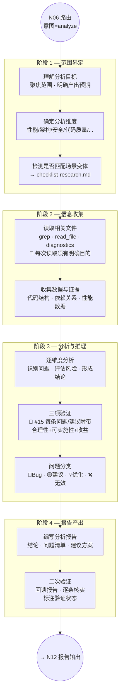

# 分析流程（Analyze）

> N09 节点的完整执行规格。适用于 `analyze` 意图：深度分析、架构评估、代码审查、技术对比。
> 🔴 **核心原则：分析流程禁止修改项目源码。** 产出是报告和结论，不是代码变更。

**版本**: v3.0.0
**最后更新**: 2026-03-12

---

## 内部流程图



> ⚠️ **注意**：分析流程**没有 CP 确认点**。原因：分析不涉及代码变更，无需授权确认。如果分析过程中发现需要修改代码，必须建议用户开启新的 `dev` 或 `fix` 任务。

---

## 阶段详述

### 阶段 1 — 范围界定

| 步骤 | 执行内容 | 产出 |
|:----:|---------|------|
| 1.1 | 理解用户的分析目标：想知道什么？关注哪些方面？ | 分析目标 |
| 1.2 | 确定分析范围：哪些文件/模块/系统？排除什么？ | 范围定义 |
| 1.3 | 明确产出预期：报告格式？需要对比数据？需要建议方案？ | 产出规格 |
| 1.4 | 确定分析维度（见下表） | 维度清单 |
| 1.5 | 检测是否匹配场景变体（技术调研等） | 变体标记 |

**分析维度参考：**

| 维度 | 适用场景 | 关注点 |
|------|---------|--------|
| 架构分析 | 评估系统设计 | 模块划分 · 依赖关系 · 扩展性 · 耦合度 |
| 代码质量 | 代码审查 | 命名规范 · 复杂度 · 重复代码 · 错误处理 |
| 性能分析 | 性能问题排查 | 瓶颈定位 · 时间复杂度 · 资源占用 |
| 安全分析 | 安全评估 | 漏洞扫描 · 敏感信息 · 权限控制 · 输入验证 |
| 依赖分析 | 依赖管理 | 过时依赖 · 安全漏洞 · 许可证合规 |
| 对比分析 | 方案选型 | 多方案对比 · 优缺点 · 适用场景 |
| 规范合规 | 规范检查 | 编码规范 · 项目规范 · 行业标准 |

### 场景变体加载

> 🔴 变体由 `RULES.md §2` 意图识别系统的**二级分类**决定，**不依赖关键词匹配**。
> AI 在 N04 阶段通过语义理解判断二级分类，§10 路由表映射到对应 checklist。

| 二级分类 | Checklist 文件 | 说明 |
|---------|---------------|------|
| 技术调研 | `checklist-research.md` | 选型、方案对比、POC 验证 |
| 常规分析（默认） | — （使用默认流程） | 架构分析、代码审查、性能分析等 |

> 命中变体时，按需读取 `checklist-research.md`（🟡按需读取），在后续阶段中叠加执行。

---

### 阶段 2 — 信息收集

| 步骤 | 执行内容 | 产出 |
|:----:|---------|------|
| 2.1 | 根据范围定义，列出需要读取的文件清单 | 文件清单 |
| 2.2 | 逐文件读取，收集相关代码片段和数据 | 原始数据 |
| 2.3 | 使用 `grep` 搜索关键模式（错误模式、命名模式、依赖引用等） | 搜索结果 |
| 2.4 | 使用 `diagnostics` 获取现有问题列表（如适用） | 诊断报告 |
| 2.5 | 收集项目上下文（profile/README.md、STATUS.md 等） | 项目背景 |

**🔴 信息收集规则：**

| 规则 | 说明 |
|------|------|
| 目的明确 | 每次 `read_file` / `grep` 须有明确的分析目的，禁止无目的批量读取 |
| Token 意识 | 大文件优先读 outline → 定位关键段落 → 按行号精确读取 |
| 证据留存 | 每个发现都必须记录来源（文件名 + 行号或函数名） |
| 禁止修改 | 🔴 读取过程中**绝对禁止**修改任何项目源码文件 |

---

### 阶段 3 — 分析与推理

| 步骤 | 执行内容 | 产出 |
|:----:|---------|------|
| 3.1 | 按维度逐项分析收集到的数据 | 维度分析结论 |
| 3.2 | 识别问题并分类（🔴Bug / 🟡建议 / 💡优化 / ❌无效） | 问题清单 |
| 3.3 | 对每条问题/建议执行三项验证（约束 #15） | 验证结果 |
| 3.4 | 评估各问题的优先级和影响范围 | 优先级排序 |
| 3.5 | 形成整体结论和行动建议 | 分析结论 |

### 🔴 三项验证（约束 #15 — 核心要求）

分析报告中的**每一条**问题、建议、方案、行动项，**必须**附带以下三项验证：

| 验证项 | 检查内容 | 标注格式 |
|--------|---------|---------|
| **合理性** | 这个问题/建议是否真实存在？是基于实际文件验证还是推断？ | `✅ 已验证` / `⚠️ 待验证` |
| **可实施性** | AI 自身或用户能否落地执行？涉及的文件/工具/流程是否确认可行？ | `✅ 可执行` / `⚠️ 需评估` |
| **收益/必要性** | 修复或采纳后的实际收益是什么？收益是否大于成本？ | 具体收益描述 |

**❌ 绝对禁止：**

- 问题/建议表格只有"问题 + 建议"两列，没有验证列
- 列出问题但不标注验证方式（未说明是已验证还是待验证）
- 基于推断输出问题而未实际读取文件验证
- 声称"5 处内容重复可用 snippet 统一"但未逐一验证每处内容是否真的相同

**已发生事故参考：**

> O1(spec snippets)：方案声称"5 处内容重复可用 snippet 统一"，实际验证发现是同概念不同详略视角，合并反而丢失信息。根因：未逐一验证每处内容的具体差异。

### 问题分类标准

| 分类 | 符号 | 定义 | 需要行动？ |
|------|:----:|------|:---------:|
| Bug | 🔴 | 实际错误，会导致功能异常或崩溃 | 是（建议开 fix 任务） |
| 建议 | 🟡 | 可改进的点，当前不影响功能但影响质量 | 是（建议优化） |
| 优化 | 💡 | 锦上添花，提升代码优雅度或微小性能 | 可选 |
| 无效 | ❌ | 经验证为误报或不适用 | 否（记录排除原因） |

---

### 阶段 4 — 报告产出

| 步骤 | 执行内容 | 产出 |
|:----:|---------|------|
| 4.1 | 按报告模板编写分析报告 | 报告草稿 |
| 4.2 | 执行二次验证（回读报告 → 逐条核实问题真实性 → 标注验证状态） | 验证后报告 |
| 4.3 | 检查报告行数（≤500 行，超出则拆分） | 合规检查 |
| 4.4 | 输出到 N12 报告流程 | 最终报告 |

**报告结构（使用 `templates/report-analysis.md`）：**

| 章节 | 内容 |
|------|------|
| 分析目标 | 用户的分析需求和关注点 |
| 分析范围 | 涉及的文件/模块/系统 |
| 分析方法 | 使用的分析维度和方法论 |
| 发现与问题 | 分类问题清单（含三项验证列） |
| 整体评估 | 综合评分/等级 + 主要结论 |
| 行动建议 | 按优先级排序的建议清单（含三项验证列） |
| 后续建议 | 推荐的下一步行动（🔴 必须在对话中同步输出摘要） |

### 二次验证规则

报告写入后，AI 必须回读报告内容，执行以下检查：

| # | 检查项 | 方法 |
|:-:|--------|------|
| V1 | 每条问题是否有文件来源（文件名+行号/函数名）？ | 逐条扫描 |
| V2 | 验证列（合理性/可实施性/收益）是否每条都填写？ | 逐条扫描 |
| V3 | 标注为"✅ 已验证"的问题是否确实读取了对应文件？ | 回溯 tool call 记录 |
| V4 | 是否有纯推测性问题混入（未标注"⚠️ 待验证"）？ | 逻辑审查 |
| V5 | 问题分类是否准确（🔴确实是 Bug？🟡确实是建议？）？ | 逐条审查 |

> 二次验证发现问题 → 立即修正报告内容，不输出给用户（AI 内部质量控制）。

---

## 🔴 禁止修改代码

分析流程中，AI **绝对禁止**执行以下操作（具体工具名因客户端而异）：

| 禁止操作 | 说明 |
|---------|------|
| 修改项目源码文件 | 只能读取，不能修改 `src/` `lib/` `app/` 等 |
| 修改项目配置文件 | 只能读取，不能修改 `package.json` `tsconfig.json` 等 |
| 删除项目文件 | 不能删除任何项目文件 |
| 移动/重命名项目文件 | 不能移动或重命名任何项目文件 |
| 在终端执行修改命令 | 不能执行 `npm install` `git commit` 等修改性命令 |

**允许的操作：**

| 允许操作 | 说明 |
|---------|------|
| 读取文件 | 读取任何文件 |
| 搜索文件内容 | 全文搜索、正则搜索 |
| 搜索文件路径 | 按名称/模式查找文件 |
| 列出目录内容 | 逐层列出目录结构 |
| 获取诊断信息 | 获取编译错误、lint 问题等 |
| 在终端执行只读命令 | `git log` · `git diff` · `npm list` · `cat` 等 |
| 写入报告/记忆文件 | 写入 `reports/` 和 `.ai-memory/` 是正常行为 |

**如果分析中发现需要修改代码：**

1. 在报告的"行动建议"中明确列出需要修改的内容
2. 在对话中输出建议摘要："建议开启 dev/fix 任务处理以下问题：…"
3. 🔴 **绝不在分析流程中直接修改**

---

## 场景变体

### 技术调研

当 N04 意图识别将任务判定为 `analyze > 技术调研` 二级分类时，由 `RULES.md §10` 路由表自动加载变体 checklist：

```text
→ 读取 workflows/analyze/checklist-research.md
```

技术调研的额外要求：

| 项 | 说明 |
|----|------|
| 方案列举 | 至少列出 2~3 个候选方案 |
| 对比维度 | 功能 · 性能 · 社区生态 · 学习曲线 · 维护成本 · 许可证 |
| 对比表格 | 多方案横向对比表（每个维度打分或定性评价） |
| 推荐结论 | 明确推荐方案 + 推荐理由 + 风险提示 |
| POC 建议 | 如需验证，建议 POC 范围和步骤 |

> 📎 技术调研的详细 checklist 在 Phase 1b 中编写。

---

## 与其他工作流的边界

| 场景 | 推荐工作流 | 原因 |
|------|----------|------|
| 纯分析（得出结论，不改代码） | `analyze` | 本流程 |
| 分析后需要修改代码 | 先 `analyze` 出报告，再开 `dev`/`fix` | 分工明确 |
| 性能优化（需改代码） | `dev`（优化子类型） | 优化需修改代码，走 build 流程 |
| 规范健康检查 | `audit` | audit 专门处理规范体系 |
| 用户只是问问题 | `chat` | 无需报告产出 |

> 🔴 **关键区分**：`analyze` 的最终产出是**报告**，不是**代码变更**。如果用户的最终目的是变更代码，应走 `dev` 或 `fix`（通过 §2 三问判断法识别）。

---

## 约束触发清单

以下约束在 analyze 工作流中被触发：

| 约束 | 触发位置 | 说明 |
|:----:|---------|------|
| #4 输出中文 | 全流程 | 报告和对话使用中文 |
| #5 自动写入 | 阶段 4 | 报告 + 记忆自动写入 |
| #7 文件名规则 | 阶段 4 | 报告命名 `NN-analysis-<简述>.md` |
| #8 序号独立 | 阶段 4 | NN 仅扫描当前 agent/日期目录 |
| #15 输出验证 | 阶段 3 | 🔴 每条问题/建议附带三项验证（核心约束） |
| #16 合理性分析 | 阶段 1 | 评估分析请求的合理性 |
| #20 文件拆分 | 阶段 4 | 报告超 500 行必须拆分 |

> 注意：约束 #1（修改确认）、#2（CP 不可跳过）、#17（关联文件）、#18（修复扫描）、#19（编码诊断）在 analyze 流程中**不适用**（因为不修改代码）。

---

## 报告自检清单（阶段 4 完成后）

在将报告提交到 N12 之前，AI 必须逐项确认：

- [ ] 分析目标和范围是否清晰？
- [ ] 每条问题/建议是否都有文件来源（精确到文件+行号/函数名）？
- [ ] 每条问题/建议是否都附带三项验证列（合理性+可实施性+收益）？
- [ ] 问题分类是否准确（🔴/🟡/💡/❌）？
- [ ] 是否有纯推测性结论混入且未标注"⚠️ 待验证"？
- [ ] 行动建议是否按优先级排序？
- [ ] 后续建议是否准备在对话中同步输出摘要？
- [ ] 报告行数是否 ≤500 行（超出则拆分）？
- [ ] 🔴 是否在分析过程中意外修改了项目源码？（必须为否）

---

## 相关文档

- `RULES.md§4` — 约束 #15 输出需验证
- `RULES.md§6` — 报告规则与自检清单
- `RULES.md§10` — 工作流路由表
- `workflows/common/confirmation-points.md` — CP 定义（analyze 不使用，但参考 CP6）
- `workflows/common/document-sync.md` — 文档同步（analyze 通常不触发）
- `workflows/analyze/checklist-research.md` — 技术调研变体（Phase 1b）
- `templates/report-analysis.md` — 分析报告模板（Phase 1b）

---

> **版本历史**: v3.0.0 (2026-03-10) — 初版，从 v2 `core/workflows/10-analysis/` + `04-research/` 重写合并