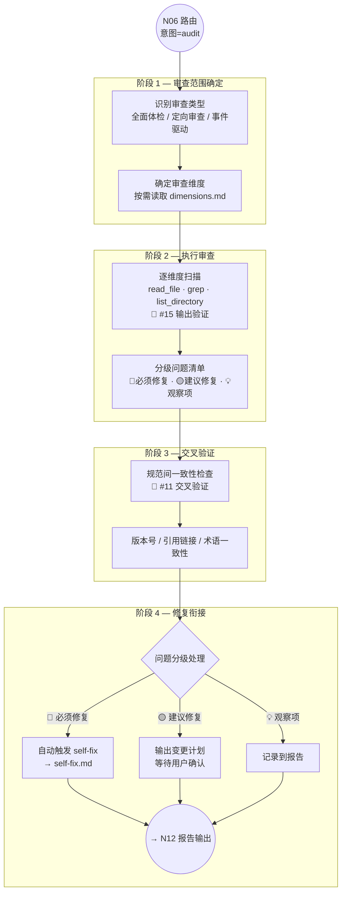

# 规范审查流程（audit）

> N09A 节点的完整执行规格。由 `RULES.md§10` 路由到此文件。
> 适用意图：`audit`（规范审查、健康检查、spec audit、一致性验证）

**版本**: v3.0.0
**最后更新**: 2026-03-12

---

## 流程图



---

## 触发方式

| 触发源 | 说明 | 示例 |
|--------|------|------|
| 用户主动请求 | 用户明确要求审查规范 | "运行规范健康检查""检查规范一致性" |
| 事件驱动 | 修改规范文件后自动触发（约束 #11） | 修改 `RULES.md` 后 |
| 定期触发 | 用户定期要求全面体检 | "做一次规范全面审查" |
| N13 衔接 | 合规自检中发现连续 2 次同类偏差 | N13 升级触发 |

---

## 阶段详述

### 阶段 1 — 审查范围确定

| 步骤 | 执行内容 | 产出 |
|:----:|---------|------|
| 1.1 | 识别审查类型：全面体检 / 定向审查 / 事件驱动 | 审查类型 |
| 1.2 | 确定审查维度（按需读取 `dimensions.md`） | 维度清单 |
| 1.3 | 确定审查范围（哪些文件/目录需要扫描） | 范围清单 |

**审查类型判定：**

| 类型 | 触发条件 | 审查范围 |
|------|---------|---------|
| 全面体检 | "全面审查""健康检查" | 所有 15 维度 |
| 定向审查 | "检查 CP 一致性""版本号对不对" | 指定维度 |
| 事件驱动 | 修改规范文件后触发 | 被修改文件的关联维度 |

> ⚠️ audit 工作流**不输出 CP1/CP2/CP3**（无需求确认 / 方案确认 / 代码授权），因为审查是只读操作。
> 如果审查结果需要修改规范文件，通过 self-fix 或变更计划 → 用户确认后执行（约束 #1）。

### 阶段 2 — 执行审查

| 步骤 | 执行内容 | 产出 |
|:----:|---------|------|
| 2.1 | 按维度逐一扫描：`read_file` 读取规范文件 · `grep` 搜索关键模式 | 扫描结果 |
| 2.2 | 对每个发现的问题进行三项验证（合理性 + 可实施性 + 收益） | 验证结论 |
| 2.3 | 按严重程度分级：🔴必须修复 · 🟡建议修复 · 💡观察项 | 分级清单 |

**🔴 审查规则：**

- 每个问题必须基于**实际文件内容**验证，禁止凭记忆或推测
- 问题必须精确到文件路径 + 行号（或章节标题）
- 必须附带三项验证列（约束 #15）
- 问题分类必须使用四级标签：🔴 Bug · 🟡 待改进 · 💡 建议 · ❌ 误报

### 阶段 3 — 交叉验证（约束 #11）

交叉验证检查规范文件间的一致性，重点关注以下方面：

| 检查项 | 说明 | 方法 |
|--------|------|------|
| 版本号一致性 | 所有规范文件的版本号是否匹配 | 扫描所有 `**版本**:` 字段 |
| 引用链接有效性 | 文件间的交叉引用链接是否指向正确位置 | 遍历 `[text](path)` 链接并验证目标存在 |
| 术语一致性 | 相同概念在不同文件中是否使用相同术语 | 关键术语对照 |
| 约束编号一致性 | RULES.md§4 的约束编号与各 workflow 中的引用是否匹配 | grep 搜索 `#N` 标注 |
| CP 定义一致性 | RULES.md§3 的 CP 速查表与 confirmation-points.md 是否一致 | 对比两处定义 |
| 路由表一致性 | RULES.md§10 的路由表与实际 workflow 文件是否对应 | 验证文件存在性 |

**交叉检查对照表：**

| 修改了... | 必须检查... |
|----------|-----------|
| `RULES.md` | 所有 `workflows/` 文件 · `copilot-instructions.md`（工作区 + 仓库副本） |
| `workflows/common/confirmation-points.md` | `RULES.md§3` · 各 workflow README |
| `workflows/common/document-sync.md` | `RULES.md§4`（#14/#21/#22） |
| `workflows/build/README.md` | `RULES.md§10` 路由表 |
| `workflows/fix/README.md` | `RULES.md§10` 路由表 |
| `workflows/analyze/README.md` | `RULES.md§10` 路由表 |
| `workflows/audit/README.md` | `RULES.md§10` 路由表 |
| `copilot-instructions.md`（工作区） | `RULES.md` 入口引用 · 仓库副本 `ai-dev-guidelines/.github/copilot-instructions.md` |
| `copilot-instructions.md`（仓库副本） | 工作区 `.github/copilot-instructions.md`（两者必须内容一致） |

### 阶段 4 — 修复衔接

根据问题的严重程度，采取不同的修复策略：

| 级别 | 处理方式 | 说明 |
|:----:|---------|------|
| 🔴 必须修复 | 自动触发 `self-fix.md` 流程 | 规范冲突、版本号不一致等结构性问题 |
| 🟡 建议修复 | 输出变更计划 → 等待用户确认 | 表述不清、内容过时等质量问题 |
| 💡 观察项 | 记录到报告，不立即处理 | 潜在风险、未来可能需要关注的问题 |

**修复衔接规则：**

- 🔴 级问题：AI 读取 `self-fix.md` → 按修复分级执行 → 安全类直接修复，内容类等待确认
- 🟡 级问题：在报告中列出变更计划 → 在对话中输出摘要 → 等待用户指示
- 💡 级问题：在报告中记录 → 在对话中简要提及 → 不阻塞流程

> 🔴 无论哪个级别的修复，涉及文件修改都必须遵守约束 #1（修改需确认），self-fix 中的"自动修复"也仅限安全类操作（数值同步、格式修正等）。

---

## 15 维度审查体系

> 完整维度定义见 `dimensions.md`（Phase 1b 编写），此处列出维度总览。

| # | 维度 | 检查重点 | 优先级 |
|:-:|------|---------|:------:|
| D1 | 文件结构完整性 | 规划的文件是否都存在？是否有孤立文件？ | 🔴 |
| D2 | 约束覆盖率 | 22 条约束是否在对应节点/文件中有落地？ | 🔴 |
| D3 | CP 体系一致性 | CP 定义与各工作流中的使用是否匹配？ | 🔴 |
| D4 | 版本号同步 | 所有规范文件版本号是否一致？ | 🔴 |
| D5 | 交叉引用有效性 | 文件间链接是否有效？指向是否正确？ | 🔴 |
| D6 | 术语一致性 | 相同概念是否在所有文件中使用统一术语？ | 🟡 |
| D7 | 记忆机制完整性 | 5+1 阶段定义是否在执行中被正确引用？ | 🟡 |
| D8 | 报告规范一致性 | 报告自检清单与 RULES.md§6 是否对齐？ | 🟡 |
| D9 | 路由表准确性 | RULES.md§10 路由表与实际文件是否对应？ | 🟡 |
| D10 | Token 防护完整性 | 三级防护定义是否在 N14 中被正确执行？ | 🟡 |
| D11 | Agent 隔离正确性 | Agent 检测规则与记忆目录是否一致？ | 🟡 |
| D12 | 事故记录追溯 | 事故参考（FIX-015 等）引用是否有效？ | 🟡 |
| D13 | 示例完整性 | 关键规则是否有 ✅/❌ 示例说明？ | 💡 |
| D14 | 行数预算合规 | 各文件是否在行数上限内？ | 💡 |
| D15 | 模板完整性 | 模板文件是否覆盖所有工作流类型？ | 💡 |

---

## 报告模板

audit 工作流的报告使用 `templates/report-audit.md`（N12 阶段读取），必须包含：

| 章节 | 内容 |
|------|------|
| 审查范围 | 审查类型 · 维度清单 · 扫描的文件/目录 |
| 问题清单 | 分级问题表格（🔴/🟡/💡），每条含：位置 · 描述 · 合理性 · 可实施性 · 收益 |
| 交叉验证结果 | 版本号 · 引用链接 · 术语 · 约束编号 — 一致性检查结果 |
| 修复记录 | 已自动修复的项 + 待用户确认的项 + 观察项 |
| 健康评分 | 综合评分（通过率 / 覆盖率指标） |
| 后续建议 | 需要关注的趋势 · 预防措施 |

**🔴 问题清单表格格式：**

```markdown
| # | 级别 | 维度 | 位置 | 描述 | 合理性 | 可实施性 | 收益 | 状态 |
|:-:|:----:|:----:|------|------|--------|---------|------|:----:|
| 1 | 🔴 | D4 | RULES.md L1 | 版本号 v3.0.0 与 document-sync.md 的 v2.9.0 不一致 | ✅ 已验证 | ✅ 直接修改 | 消除版本混乱 | 🔧 已修复 |
| 2 | 🟡 | D11 | build/README.md §阶段2 | "技术方案"与 confirmation-points.md 中的"方案设计"术语不一致 | ✅ 已验证 | ✅ 统一术语 | 减少歧义 | ⏳ 待确认 |
```

---

## 约束触发清单

以下约束在 audit 工作流中被触发：

| 约束 | 触发位置 | 说明 |
|:----:|---------|------|
| #1 修改需确认 | 阶段 4 | 修复涉及文件修改时，必须等待确认（安全类 self-fix 除外） |
| #5 自动写入 | N12 | 审查报告 + 记忆自动写入 |
| #11 交叉验证 | 阶段 3 | 规范间一致性检查 |
| #13 自检自修复 | 阶段 4 | 衔接 self-fix 流程 |
| #15 输出验证 | 阶段 2 | 每条问题附带三项验证 |
| #16 合理性分析 | 阶段 2 | 评估问题的真实性，避免误报 |

---

## 与其他工作流的关系

| 场景 | 推荐 | 原因 |
|------|------|------|
| 用户要求"检查规范" | `audit` | 本流程 |
| 修改规范文件后自动触发 | `audit`（事件驱动模式） | 约束 #11 |
| N13 发现连续同类偏差 | `audit`（N13 衔接） | 升级分析 |
| 用户要求"修复规范" | `audit` → self-fix | 审查后修复 |
| 用户要求"分析代码" | `analyze` | audit 只审查规范，不审查代码 |
| 用户指出规范问题（"规范不对"） | `audit`（用户反馈触发） | self-fix.md 模式 |

> ⚠️ **audit 与 analyze 的区别**：audit 审查的对象是**规范文件本身**（ai-dev-guidelines 下的文件），analyze 分析的对象是**项目代码**（src/、lib/ 等）。

---

## 事件驱动模式（约束 #11 衔接）

当 AI 修改了规范文件时（`RULES.md`、`workflows/`、`copilot-instructions.md` 等），自动进入审查的简化流程：

```text
修改规范文件
  ↓
自动触发交叉验证（阶段 3 直接执行）
  ↓
检查引用该文件的所有关联文件
  ↓
发现不一致 → 生成修复建议 → 用户确认后修复
未发现问题 → 记录审查结果到报告
```

> 事件驱动模式不需要经过阶段 1（范围确定）和完整的阶段 2（多维度扫描），直接执行阶段 3（交叉验证）+ 阶段 4（修复衔接）。

---

## self-fix 衔接点

audit 工作流与 `self-fix.md` 的衔接关系：

| 场景 | 行为 |
|------|------|
| audit 发现 🔴 级问题 | 自动读取 `self-fix.md` → 按修复分级执行 |
| audit 发现 🟡 级问题 | 输出变更计划 → 用户确认后可手动触发 self-fix |
| AI 执行中发现规范冲突 | 不经过 audit，直接触发 self-fix（贯穿式触发） |
| 用户抱怨/指出规范问题 | 可经过 audit 走完整流程，也可直接 self-fix |

> 📎 self-fix 详细规则：`workflows/audit/self-fix.md`

---

## 相关文档

- `RULES.md§4` — 约束 #11（交叉验证）/ #13（自检自修复）
- `RULES.md§11` — 规范自修复触发规则速查
- `workflows/audit/dimensions.md` — 15 维度审查定义（Phase 1b）
- `workflows/audit/self-fix.md` — 自修复规则
- `templates/report-audit.md` — 审查报告模板（Phase 1b）

---

> **版本历史**: v3.0.0 (2026-03-10) — 初版，从 v2 `core/workflows/11-self-audit/` + `core/self-fix/` 重写整合