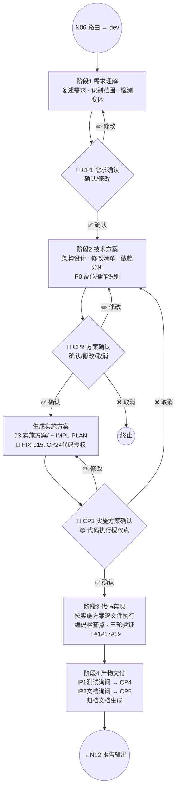

# 开发流程（Build）

> N07 节点的完整执行规格。适用于 `dev` 意图：新需求、重构、数据库变更、项目初始化、性能优化。

**版本**: v3.0.0
**最后更新**: 2026-03-12

---

## 内部流程图



---

## 阶段1：需求理解

### 执行步骤

| 步骤 | 动作 | 产出 |
|:----:|------|------|
| 1.1 | 读取用户需求，用自己的话复述核心目标 | 需求复述 |
| 1.2 | 识别改造范围（需要改 / 不需要改） | 范围清单 |
| 1.3 | 识别关键约束（技术栈、性能、兼容性） | 约束列表 |
| 1.4 | 根据 N04 意图识别结果确定二级分类（重构/数据库/初始化/优化） | 变体标记 |
| 1.5 | 读取 `profile/README.md`（涉及代码修改时） | 项目上下文 |

### 场景变体加载

> 🔴 变体由 `RULES.md §2` 意图识别系统的**二级分类**决定，**不依赖关键词匹配**。
> AI 在 N04 阶段通过语义理解判断二级分类，§10 路由表映射到对应 checklist。

| 二级分类 | Checklist 文件 | 说明 |
|---------|---------------|------|
| 项目初始化 | `checklist-init.md` | 从零搭建新项目 |
| 重构 | `checklist-refactor.md` | 改善内部结构，行为不变 |
| 数据库 | `checklist-database.md` | Schema/迁移/索引变更 |
| 性能优化 | `checklist-optimization.md` | 提升性能指标 |
| 新需求（默认） | — （使用默认流程） | 常规功能开发 |

> 命中变体时，按需读取对应 `checklist-*.md`（🟡按需读取），在后续阶段中叠加执行。

### CP1 输出

🔴 **产物文件先行规则**：先将需求定义写入 `requirements/<中文描述>/01-需求定义.md`（路径见 §7），然后在对话中输出 CP1 确认格式并**引用文件链接**。禁止仅在对话中输出而不写文件。

输出需求理解确认（格式见 `confirmation-points.md` CP1 章节），等待用户确认后进入阶段2。

---

## 阶段2：技术方案 + 实施方案

### 2A 技术方案设计

| 步骤 | 动作 | 产出 |
|:----:|------|------|
| 2.1 | 设计技术方案（架构、关键实现思路） | 方案概述 |
| 2.2 | 列出文件修改清单（文件 + 操作 + 说明） | 修改清单 |
| 2.3 | 分析依赖变更（新增/升级/移除） | 依赖清单 |
| 2.4 | 识别 P0 高危操作（数据库DDL、配置变更等） | P0 清单 |
| 2.5 | 估算工作量（文件数 → 模板选择） | lite/core |

**模板选择规则：**

| 条件 | 模板 | 归档文档 |
|------|------|---------|
| < 5 文件、单模块 | `templates/` lite 系列 | 内容可精简，但文件必须存在 |
| ≥ 5 文件、多模块 | `templates/` core 系列 | 完整内容 |

### CP2 输出

🔴 **产物文件先行规则**：先将技术方案写入 `requirements/<中文描述>/02-技术方案.md`（路径见 §7），然后在对话中输出 CP2 确认格式并**引用文件链接**。禁止仅在对话中输出而不写文件。

输出技术方案确认（格式见 `confirmation-points.md` CP2 章节），包含 P0 清单（如有）。

### 🔴 CP2→CP3 过渡（FIX-015）

CP2 确认后的**唯一合法下一步**：

1. 生成 `03-实施方案/` 目录（含按依赖顺序的变更文件）
2. 生成 `IMPLEMENTATION-PLAN.md`（🔴 强制，大小需求均需）
3. 输出 CP3 等待确认

> 🚫 禁止将 CP2 确认解读为代码执行授权。事故参考：issue#15。

### 跨会话 CP 衔接规则

当开发任务从上一会话延续时（用户说"继续上次的开发"/"执行实施方案"等）：

| 条件 | 行为 |
|------|------|
| 上次已完成 CP1+CP2+CP3 且方案未改变 | 输出简化版 CP3（列出实施清单），确认后继续 |
| 上次已完成 CP1+CP2（未到 CP3） | 输出简化版 CP2 + 生成实施方案 → CP3 |
| 上次方案有修改 | 重新输出完整 CP（从变更处开始） |
| 🔴 禁止 | 将"继续/执行"直接解读为 CP 确认后开始修改文件 |

### 2B 实施方案生成

| 步骤 | 动作 | 产出 |
|:----:|------|------|
| 2.6 | 按依赖顺序编排实施步骤 | 步骤清单 |
| 2.7 | 为每个文件编写变更摘要 | 变更详情 |
| 2.8 | 生成 IMPLEMENTATION-PLAN.md | 实施计划 |
| 2.9 | 准备回滚方案（P0 操作必须具体可执行） | 回滚方案 |

### IMPLEMENTATION-PLAN.md 结构

```markdown
# 实施计划

## 任务清单

| # | 任务 | 文件 | 状态 | 说明 |
|:-:|------|------|:----:|------|
| T1 | 创建配置文件 | config/xxx.ts | ⏳ | 初始配置 |
| T2 | 实现核心逻辑 | src/xxx.ts | ⏳ | 主要功能 |
| T3 | 注册到应用 | src/app.ts | ⏳ | 集成 |

## 依赖关系
T1 → T2 → T3

## 中断恢复
按任务编号从最后一个 ✅ 的下一个开始
```

### CP3 输出

输出实施方案确认（格式见 `confirmation-points.md` CP3 章节）。🟢 用户确认后，代码执行授权生效。

---

## 阶段3：代码实现

### 执行规则

| 规则 | 说明 |
|------|------|
| 按方案执行 | 严格按 IMPLEMENTATION-PLAN.md 的任务顺序逐文件执行 |
| 约束 #1 | 修改/删除文件前输出变更计划等待确认（已由 CP3 覆盖整体方案，单文件无需再确认） |
| 约束 #17 | 每次修改/新建/重命名文件后，检查所有引用该文件的关联文件并同步 |
| 约束 #19 | 每次代码修改后运行 `diagnostics`，error 立即修复（最多 2 次） |
| 约束 #3 | 禁止硬编码敏感信息（API Key/密码/Token） |

### 编码检查点（约束 #9 · #18 — 变更 ≥3 文件时触发）

| 模式 | 触发条件 | 检查点内容 |
|------|---------|----------|
| 有 IMPL-PLAN | 按任务编号 | 每完成一个 TN → 更新状态为 ✅ → 写入记忆 📦 检查点 |
| 无 IMPL-PLAN | 每 3 文件 | 写入记忆 📦 检查点：已完成文件清单 + 下一步 |

**检查点格式（记忆中）：**

```text
📦 编码检查点 (T3/T5 完成):
  - ✅ T1: config/xxx.ts — 已创建
  - ✅ T2: src/xxx.ts — 已实现
  - ✅ T3: src/app.ts — 已集成
  - ⏳ T4: test/xxx.test.ts — 待写
  - ⏳ T5: docs/README.md — 待更新
```

### 编码质量规则

| 规则 | 说明 |
|------|------|
| 错误处理 | 所有 async 函数必须有 try/catch 或 `.catch()`；所有可能失败的操作必须有错误处理 |
| 类型安全 | TypeScript 项目禁止 `any`（除非有明确注释说明原因） |
| 命名规范 | 遵循项目 `profile/README.md` 中定义的命名约定 |
| 导入顺序 | 外部依赖 → 内部模块 → 类型导入 → 相对路径 |

### 三轮验证（每个文件修改完成后）

| 轮次 | 验证类型 | 检查内容 |
|:----:|---------|---------|
| 1 | 逻辑验证 | 实现是否符合需求？边界条件是否处理？ |
| 2 | 技术验证 | 类型是否正确？API 用法是否正确？依赖是否存在？ |
| 3 | 完整性验证 | 导入/导出是否完整？关联文件是否同步？错误处理是否覆盖？ |

> 三轮验证为 AI 内部执行（不需输出给用户），发现问题立即修复。

### 重构变体补充规则（约束 #18）

重构类任务在代码实现阶段额外执行：
- 修复后三步扫描（同类全局扫描 → 数据联动扫描 → grep 零残留复核）
- 原因：重构本质上是"修复架构问题"，需要确保无残留

---

## 阶段4：产物交付

### 4.1 测试（按需）

1. 代码实现完成后，输出 **IP1**（测试产物询问）
2. 用户选择后执行对应测试生成
3. 运行测试 → 输出 **CP4**（测试结果确认）

### 4.2 文档（按需）

1. 测试完成（或跳过）后，输出 **IP2**（文档产物询问）
2. 用户选择后执行对应文档生成/更新
3. 输出 **CP5**（文档确认）

### 4.3 归档文档（🔴 强制）

无论大小需求，以下文件必须存在（小需求内容可精简）：

| 文件 | 说明 |
|------|------|
| `01-需求定义.md` | 需求描述（CP1 内容的持久化） |
| `02-技术方案.md` | 技术方案（CP2 内容的持久化） |
| `03-实施方案/` | 实施方案目录（CP3 内容的持久化） |
| `IMPLEMENTATION-PLAN.md` | 实施计划（含最终任务状态） |

**存放位置（按 §7 子类型路由）：**
- 新需求 / 重构 / 数据库 / 项目初始化：`projects/<project>/requirements/<中文描述>/`
- 性能优化：`projects/<project>/optimizations/<中文描述>/`

### 退出到 N12

阶段4 完成后，流程进入 N12（报告输出+二次验证）。

---

## 工作流专属验证清单

在 N13（合规自检）阶段，build 工作流额外检查：

| # | 检查项 | 说明 |
|:-:|--------|------|
| B1 | 需求点覆盖 | 所有需求有对应实现？ |
| B2 | 接口契约 | 入参/出参/错误码定义完整？ |
| B3 | 配置完整 | 新增配置项有默认值和说明？ |
| B4 | 归档文档存在 | 01/02/03/IMPL-PLAN 文件均存在？ |
| B5 | IMPL-PLAN 终态 | 所有任务状态已更新为 ✅ 或明确标注遗留？ |
| B6 | 编码检查点完整 | 变更 ≥3 文件时，记忆中有 📦 检查点？ |

---

## 场景变体 Checklist

> 以下变体在阶段1检测后加载，叠加到默认流程上执行（Phase 1b 编写具体文件）。

| 变体 | 文件 | 关键补充点 |
|------|------|----------|
| 项目初始化 | `checklist-init.md` | 脚手架选型 · 目录结构 · 基础配置 · CI/CD · README |
| 重构 | `checklist-refactor.md` | 影响范围分析 · 兼容性 · 修复后三步扫描 · 回归测试 |
| 数据库 | `checklist-database.md` | DDL 审查 · 迁移脚本 · 回滚脚本 · 数据备份 |
| 性能优化 | `checklist-optimization.md` | 基线数据 · 优化方案 · 对比验证 · 稳定性测试 |

---

## 约束触发清单

以下约束在 build 工作流中被触发：

| 约束 | 触发位置 | 说明 |
|:----:|---------|------|
| #1 修改需确认 | 阶段 3 | CP3 已授权变更范围内的修改 |
| #2 CP 不可跳过 | CP1 · CP2 · CP3 | 严格顺序执行 |
| #3 禁止硬编码 | 阶段 3 | 代码中不得硬编码敏感信息 |
| #5 自动写入 | N12 | 报告 + 记忆自动写入 |
| #15 输出验证 | 报告 | 问题/建议附带三项验证 |
| #17 关联文件 | 阶段 3 | 修改/新建/重命名后检查关联文件 |
| #19 编码后诊断 | 阶段 3 | 每个文件修改后 diagnostics |
| #22 文档同步 | 阶段 4 | 涉及代码变更时检查 STATUS/CHANGELOG/TASK-INDEX |

---

## 相关文档

- CP 定义：`workflows/common/confirmation-points.md`
- 文档同步：`workflows/common/document-sync.md`
- 报告规则：`RULES.md §6`
- 约束速查：`RULES.md §4`
- 报告模板：`templates/report-build.md`

---

> **版本历史**: v3.0.0 (2026-03-10) — 从 v2 `core/workflows/01-requirement-dev/` 等多个工作流重写合并