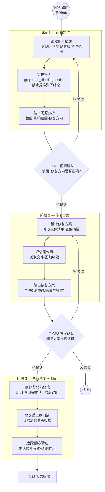

# 修复流程（fix）

> N08 修复流程的完整执行规范。由 `RULES.md§10` 路由到此文件。
> 适用意图：`fix`（修复、Bug、报错、异常、事故、安全漏洞）

**版本**: v3.0.0
**最后更新**: 2026-03-12

---

## 流程图



---

## 阶段详述

### 阶段 1 — 问题定位

| 步骤 | 执行内容 | 产出 |
|:----:|---------|------|
| 1.1 | 理解用户描述：复现步骤、错误信息、期望行为、实际行为 | 问题摘要 |
| 1.2 | 定位根因：`grep` 搜索相关代码 · `read_file` 查看上下文 · `diagnostics` 检查现有错误 | 根因定位 |
| 1.3 | 分析影响范围：哪些文件/模块受影响、是否有关联 Bug | 影响范围 |
| 1.4 | 输出 CP1：问题分析 + 根因 + 修复方向 | CP1 展示 |

**🔴 定位规则：**

- 必须实际读取代码文件验证根因，禁止仅凭用户描述或推测下结论
- 根因必须精确到文件+行号（或函数名），不接受模糊定位（如"可能在某处"）
- 如果用户描述不足以定位，主动询问补充信息（错误日志、复现步骤等）

### 阶段 2 — 修复方案

| 步骤 | 执行内容 | 产出 |
|:----:|---------|------|
| 2.1 | 设计修复方案：最小化变更 · 优先修正根因而非症状 | 修复方案 |
| 2.2 | 列出修改文件清单（表格：文件 \| 操作 \| 变更说明） | 变更清单 |
| 2.3 | 评估副作用：关联文件检查 · 回归风险评估 | 风险评估 |
| 2.4 | 输出 CP2：修复方案 + 变更清单 + P0 清单（如有） | CP2 展示 |

**🔴 方案规则：**

- 优先最小化修复（只改必须改的），避免在修 Bug 时顺带重构
- 如果修复需要较大范围改动，必须在 CP2 中说明原因
- P0 操作（如数据库 schema 变更、配置修改）必须逐项展示回滚方案

> ⚠️ **fix 工作流不经过 CP3**：CP2 确认后直接执行修复。原因：修复通常是小范围精确变更，无需单独的实施方案阶段。如果修复涉及大范围改动（≥5 文件），建议切换到 `dev` 工作流（含 CP3）。

### 跨会话 CP 衔接规则

当修复任务从上一会话延续时（用户说"执行上次的计划"/"继续修复"等）：

| 条件 | 行为 |
|------|------|
| 上次已完成 CP1+CP2 且变更计划未改变 | 输出简化版 CP2（列出变更清单），确认后执行 |
| 上次变更计划有修改 | 重新输出完整 CP2 |
| 🔴 禁止 | 将"执行/继续"直接解读为 CP 确认后开始修改文件 |

> 事故参考：AI 在新会话中收到"执行修复建议"后，未输出 CP 确认直接执行 13 项文件修改。

### 阶段 3 — 执行修复 + 验证

| 步骤 | 执行内容 | 触发约束 |
|:----:|---------|---------|
| 3.1 | 按修复方案逐文件执行代码修改 | #1 修改需确认（变更计划已在 CP2 确认） |
| 3.2 | 每个文件修改后运行 `diagnostics` | #19 编码后诊断 |
| 3.3 | 执行修复后三步扫描（详见下方） | #18 修复需扫描 |
| 3.4 | 检查关联文件是否需要同步更新 | #17 关联文件检查 |
| 3.5 | 运行测试验证修复有效 + 无副作用 | — |
| 3.6 | 输出修复结果 → N12 报告 | #5 报告自动写入 |

---

## 🔴 修复后三步扫描（约束 #18）

修复完成后，**必须**按以下三步依次执行扫描，确保修复完整且无残留：

### Step 1 — 同类问题全局扫描

```text
修了什么？ → grep 全项目搜索同类问题 → 确认零残留
```

| 项 | 说明 |
|----|------|
| 目的 | 确保相同的 Bug 模式没有出现在其他位置 |
| 方法 | 用 `grep` 搜索与 Bug 相关的模式（错误的 API 调用、错误的逻辑判断等） |
| 产出 | 同类问题清单（如有）→ 一并修复或记录为待办 |

**示例：**

```text
修复了 userService.ts 中的 null 检查遗漏
→ grep 搜索项目中所有类似的 .findOne() 调用
→ 检查是否都有 null 检查
→ 发现 orderService.ts 中也有同样遗漏 → 一并修复
```

### Step 2 — 数据联动扫描

```text
改了哪个文件的数据？ → 找引用该数据的文件 → 逐一检查是否需要同步
```

| 项 | 说明 |
|----|------|
| 目的 | 确保修改的数据结构/接口/类型在所有引用处保持一致 |
| 方法 | `grep` 搜索被修改的函数名/变量名/类型名，检查所有引用处 |
| 产出 | 联动更新清单 → 同步修改 |

**示例：**

```text
修复 getUser() 的返回类型（新增 email 字段）
→ grep 搜索所有调用 getUser() 的文件
→ 检查调用方是否正确处理新字段
→ 发现 profile.tsx 需要更新类型定义 → 同步修改
```

### Step 3 — 声明前复核

在向用户报告"修复完成"之前，必须确认以下清单：

```text
□ grep 全项目确认同类问题零残留？
□ 所有引用被修改数据的文件已检查/同步？
□ diagnostics 无 error？
□ 测试通过（如有）？
□ 修改范围与 CP2 方案一致（未超出范围）？
```

> 🔴 **只有以上全部通过，才能声称修复完成。** 任何一项未通过，需回到对应步骤处理后重新复核。

---

## 三轮验证框架

fix 工作流在阶段 2（方案设计）和阶段 3（执行验证）中应用三轮验证：

| 轮次 | 验证内容 | 验证方法 |
|:----:|---------|---------|
| 逻辑验证 | 修复方案是否真正解决根因？是否只治标不治本？ | 追溯错误路径，验证方案切断根因 |
| 技术验证 | 修复代码是否正确？类型是否匹配？边界条件是否覆盖？ | `diagnostics` + 代码审查 |
| 完整性验证 | 同类问题是否都已修复？关联文件是否已同步？ | 三步扫描（Step 1~3） |

---

## 场景变体

### 事故处理

当 N04 意图识别将任务判定为 `fix > 事故处理` 二级分类时，由 `RULES.md §10` 路由表自动加载变体 checklist：

```text
→ 读取 workflows/fix/checklist-incident.md
```

事故处理的额外要求：

| 项 | 说明 |
|----|------|
| 时间线记录 | 从发现到修复的完整时间线 |
| 影响评估 | 影响用户数 · 影响时长 · 数据损失 |
| 根因分析 | 5-Why 分析法 |
| 防复现措施 | 修复后的预防机制 |
| 复盘报告 | 事故复盘文档（写入报告） |

### 安全修复

当 N04 意图识别将任务判定为 `fix > 安全修复` 二级分类时：

```text
→ 读取 workflows/fix/checklist-security.md
```

安全修复的额外要求：

| 项 | 说明 |
|----|------|
| 漏洞分类 | CVE 编号（如有）· OWASP 分类 |
| 影响评估 | 可利用性 · 影响范围 · 严重程度 |
| 修复验证 | 必须验证漏洞已无法复现 |
| 全局扫描 | 同类漏洞全项目扫描（Step 1 强化） |
| 依赖检查 | 相关依赖是否需要升级 |

---

## CP 在 fix 工作流中的位置

```text
阶段 1（问题定位）
  ↓
CP1: 问题确认（根因 + 修复方向）
  ↓
阶段 2（修复方案）
  ↓
CP2: 方案确认（修复方案 + 变更清单 + P0 清单）
  ↓
阶段 3（执行修复 + 三步扫描 + 验证）
  ↓
→ N12 报告输出 → N12A → (GIT) → N13 → N14
```

### CP 规则在 fix 中的具体应用

| 规则 | fix 工作流适用方式 |
|------|------------------|
| CP 不可跳过 | CP1、CP2 均必须等待用户明确响应 |
| CP 不可合并 | 即使修复很简单，CP1 和 CP2 也必须分开 |
| 确认记录 | 每次 CP 确认/修正写入记忆 |
| 修改需确认 | CP2 已确认变更计划，执行时不再逐文件确认（CP2 = 变更授权） |

> ⚠️ 如果修复执行中发现需要额外修改（超出 CP2 方案范围），必须暂停并补充说明，获取用户确认后再继续。

---

## 报告模板

fix 工作流的报告使用 `templates/report-fix.md`（N12 阶段读取），必须包含：

| 章节 | 内容 |
|------|------|
| 问题描述 | 用户报告的问题 + 复现步骤 |
| 根因分析 | 定位过程 + 根因说明（精确到文件+行号） |
| 修复方案 | 方案概述 + 变更清单 |
| 修复结果 | 变更详情 + diff 摘要 |
| 验证结果 | 三步扫描结果 + 测试结果 |
| 后续建议 | 防复现建议 + 相关优化（如有） |

> 🔴 报告中的每条问题/建议必须附带验证列（合理性 + 可实施性 + 收益），详见 `RULES.md§6`

---

## 约束触发清单

以下约束在 fix 工作流中被触发：

| 约束 | 触发位置 | 说明 |
|:----:|---------|------|
| #1 修改需确认 | 阶段 3 | CP2 已授权变更范围内的修改 |
| #2 CP 不可跳过 | CP1 · CP2 | 严格顺序执行 |
| #3 禁止硬编码 | 阶段 3 | 修复代码中不得硬编码敏感信息 |
| #5 自动写入 | N12 | 报告 + 记忆自动写入 |
| #15 输出验证 | 报告 | 问题/建议附带三项验证 |
| #17 关联文件 | 阶段 3 | 修改后检查关联文件 |
| #18 修复扫描 | 阶段 3 | 三步扫描（🔴 fix 专属） |
| #19 编码后诊断 | 阶段 3 | 每个文件修改后 diagnostics |

---

## 与其他工作流的边界

| 场景 | 推荐工作流 | 原因 |
|------|----------|------|
| 简单 Bug 修复（1~4 文件） | `fix` | 本流程 |
| 复杂 Bug 修复（≥5 文件） | `dev`（重构子类型） | 需要 CP3 + 实施方案 |
| Bug 修复后发现需要重构 | 先 `fix` 完成，再开新任务 `dev` | 避免修复范围蔓延 |
| 性能问题 | `dev`（优化子类型） | 性能优化需修改代码，走 build 流程 |
| 纯分析（不修改代码） | `analyze` | fix 必须产出代码变更 |

---

## 相关文档

- `RULES.md§3` — CP 速查表
- `RULES.md§4` — 约束 #18 修复需扫描
- `workflows/common/confirmation-points.md` — CP 完整定义
- `workflows/common/document-sync.md` — CP6 / Git 同步
- `workflows/fix/checklist-incident.md` — 事故处理变体（Phase 1b）
- `workflows/fix/checklist-security.md` — 安全修复变体（Phase 1b）

---

> **版本历史**: v3.0.0 (2026-03-10) — 初版，从 v2 `02-bug-fix` + `07-security` + `08-incident` 重写整合