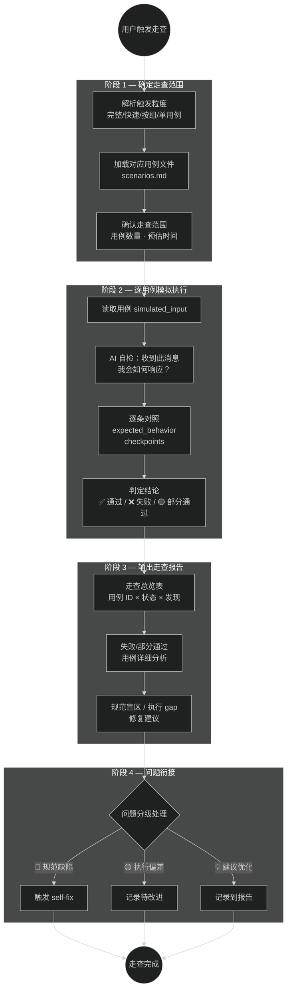

# 场景化走查工作流（Walkthrough）

> 以用户视角模拟真实场景，验证规范体系的可执行性和 AI 行为合规性。
> 本工作流是"质量保障工具"，不计入工作流路由表（§10）。
> 类比操作系统中的"系统自检/诊断程序"，不属于用户进程调度。

**版本**: v3.0.0
**最后更新**: 2026-03-10

---

## 与其他机制的边界

| 机制 | 定位 | 面向对象 | 协作关系 |
|------|------|---------|---------|
| **walkthrough**（本工作流） | 预防式 — 模拟场景验证 AI 行为合规性 | 面向**行为** | 下游（验证执行是否合规） |
| **audit** | 审查式 — 检查规范文件一致性和完整性 | 面向**文档** | 上游（审查文档，走查验证行为） |
| **self-fix** | 反应式 — 发现问题后修复 | 面向**问题** | 走查发现问题 → 交给 self-fix 修复 |

```text
audit（文档一致性审查）
  ↓ 上游产出
walkthrough（行为合规性验证）
  ↓ 发现问题
self-fix（修复规范问题）
```

---

## 触发条件

### 消息触发（用户主动）

| 触发关键词 | 示例 |
|-----------|------|
| 规范走查 / 场景验证 / walkthrough | "做一次规范走查" |
| 模拟用户 / 走查用例 | "走查用例 W01" |
| 验证规范执行 / 流程走查 | "验证 fix 流程的执行合规性" |
| 边界验证 | "走查 fix vs build 的边界场景" |

### 触发粒度（4 种）

| 粒度 | 关键词 | 执行范围 |
|------|--------|---------|
| 完整走查 | "完整规范走查" | 全部用例（workflow + flow-control + edge-case） |
| 快速走查 | "快速规范走查" | 核心用例（每个工作流 1 条，约 5~6 条） |
| 按组走查 | "走查流程控制场景" | 指定分组 |
| 单用例走查 | "走查 W01" | 指定用例 ID |

### 建议触发时机

| 时机 | 说明 |
|------|------|
| 规范版本升级后（major/minor） | 验证新版本的执行合规性 |
| audit 完成后 | 文档审查后追加行为验证 |
| 新增工作流/约束/机制后 | 验证新增内容的可执行性 |
| 新 Agent 首次接入规范时 | 验证 Agent 对规范的理解和执行 |

---

## 用例体系

### 用例分组

| 分组 | 前缀 | 覆盖范围 | 文件 |
|------|:----:|---------|------|
| 工作流场景 | W | build / fix / analyze / audit / chat / resume 的正常路径 | `scenarios.md §工作流场景` |
| 流程控制场景 | F | 预检查 / 记忆 / 确认点 / 报告 / 出口门禁 | `scenarios.md §流程控制场景` |
| 边界场景 | E | fix vs build 边界 / 异常处理 / 禁止行为 / CP 差异 | `scenarios.md §边界场景` |

> 完整用例定义见 [`scenarios.md`](./scenarios.md)

### 用例格式规范

每个用例采用统一 YAML 结构：

```yaml
- id: "W01"                          # 用例 ID（W=workflow / F=flow / E=edge）
  name: "需求开发正常路径"              # 用例名称
  category: workflow                   # 分类
  source_ref: "workflows/build"        # 规范来源（验证依据）
  simulated_input: "用户模拟输入"       # 模拟的用户消息
  expected_behavior:                   # 期望 AI 行为（有序列表）
    - "行为 1"
    - "行为 2"
  checkpoints:                         # 关键检查点
    - "检查点 1"
  pass_criteria: "通过标准"             # 一句话通过判定
  fail_indicators:                     # 失败信号（出现任一即失败）
    - "失败信号 1"
```

---

## 执行流程（4 阶段）



---

### 阶段 1 — 确定走查范围

| 步骤 | 执行内容 | 产出 |
|:----:|---------|------|
| 1.1 | 解析用户走查请求的粒度（完整/快速/按组/单用例） | 粒度类型 |
| 1.2 | 加载 `scenarios.md` 中对应的用例集合 | 用例清单 |
| 1.3 | 向用户确认走查范围和用例数量 | 范围确认 |

> ⚠️ walkthrough 不需要 CP1/CP2/CP3（无需求/方案/代码确认），但需确认走查范围。

### 阶段 2 — 逐用例模拟执行

| 步骤 | 执行内容 | 产出 |
|:----:|---------|------|
| 2.1 | 读取用例的 `simulated_input`（模拟用户消息） | 模拟输入 |
| 2.2 | AI 自检：如果收到这条消息，我会如何响应？按规范应该如何响应？ | 预期 vs 实际 |
| 2.3 | 逐条对照 `expected_behavior`，检查是否每条都会被执行 | 行为对照 |
| 2.4 | 逐条检查 `checkpoints`，确认关键检查点是否覆盖 | 检查点验证 |
| 2.5 | 判定 `pass_criteria` 是否满足 | 通过判定 |
| 2.6 | 检查是否触发任何 `fail_indicators` | 失败检测 |
| 2.7 | 记录结论：✅ 通过 / ❌ 失败 / 🟡 部分通过 | 用例结论 |

**判定标准：**

| 结论 | 条件 |
|:----:|------|
| ✅ 通过 | 所有 `expected_behavior` 和 `checkpoints` 满足，无 `fail_indicators` 触发 |
| 🟡 部分通过 | 大部分行为正确，但有 1~2 个检查点未完全满足 |
| ❌ 失败 | 关键行为缺失，或触发了 `fail_indicators` 中的任一项 |

**🔴 模拟执行规则：**

| 规则 | 说明 |
|------|------|
| 诚实自检 | AI 必须诚实评估自身行为，不能为了通过而"美化"预期响应 |
| 基于规范 | 对照点是当前规范文件的实际内容，不是 AI 的记忆或推测 |
| 记录差异 | 如果实际行为与规范期望不一致，必须如实记录差异和原因 |
| 不修改规范 | 走查过程中禁止修改规范文件来"修正"差异 |

### 阶段 3 — 输出走查报告

| 步骤 | 执行内容 | 产出 |
|:----:|---------|------|
| 3.1 | 编写走查总览表（用例 ID × 状态 × 发现摘要） | 总览表 |
| 3.2 | 对失败/部分通过的用例编写详细分析（差异 · 原因 · 建议） | 详细分析 |
| 3.3 | 归纳发现的规范盲区或执行 gap | 盲区清单 |
| 3.4 | 按三项验证（合理性 · 可实施性 · 收益）校验每条发现 | 验证结果 |
| 3.5 | 输出到 N12 报告流程 | 走查报告 |

**报告存放路径：**

```text
reports/analysis/<agent>/YYYYMMDD/NN-analysis-场景化走查.md
```

**报告结构：**

| 章节 | 内容 |
|------|------|
| 走查范围 | 触发方式 · 用例粒度 · 用例数量 |
| 走查总览表 | 用例 ID × 名称 × 状态 × 发现摘要 |
| 失败/部分通过用例详细分析 | 每个非通过用例的：差异描述 · 根因 · 修复建议 |
| 规范盲区清单 | 未被规范覆盖的场景或行为 |
| 统计信息 | 通过率 · 各分组通过率 · 主要问题类别分布 |
| 修复建议 | 按优先级排序的改进建议（含三项验证） |
| 后续建议 | 推荐的下一步行动 |

**走查总览表格式：**

```markdown
| # | ID | 名称 | 分组 | 状态 | 发现摘要 |
|:-:|:--:|------|:----:|:----:|---------|
| 1 | W01 | 需求开发正常路径 | workflow | ✅ | — |
| 2 | W02 | Bug 修复正常路径 | workflow | 🟡 | CP2 后未提示三步扫描 |
| 3 | F01 | 预检查完整执行 | flow | ❌ | 阶段0记忆写入被跳过 |
```

### 阶段 4 — 问题衔接

| 步骤 | 执行内容 | 产出 |
|:----:|---------|------|
| 4.1 | 对失败用例的发现进行分级（🔴 规范缺陷 / 🟡 执行偏差 / 💡 建议优化） | 分级结果 |
| 4.2 | 🔴 规范缺陷 → 触发 `self-fix.md` 流程修复规范 | 修复记录 |
| 4.3 | 🟡 执行偏差 → 记录到记忆的 ⚠️ 待跟进，标注需要在后续会话中关注 | 待跟进记录 |
| 4.4 | 💡 建议优化 → 记录到报告，不立即处理 | 报告记录 |
| 4.5 | 更新记忆文件（走查结果摘要 + 问题清单） | 记忆更新 |

**问题分级标准：**

| 级别 | 定义 | 处理方式 | 示例 |
|:----:|------|---------|------|
| 🔴 规范缺陷 | 规范文件中确实缺少了必要的规则/定义/约束 | 触发 self-fix | CP 定义中遗漏了某个工作流的 CP 规则 |
| 🟡 执行偏差 | 规范存在但 AI 在执行中容易偏离（规范表述不够清晰或 AI 理解有歧义） | 记录 + 建议优化表述 | 三步扫描描述模糊，AI 不确定何时执行 |
| 💡 建议优化 | 规范可以更好但当前不影响执行（锦上添花） | 记录到报告 | 某个 checklist 可以增加更多示例 |

---

## 通用验证要点

### 预检查（每个场景必查）

无论走查哪个场景，以下预检查相关行为是每个用例的**隐含检查点**：

| # | 检查项 | 期望行为 |
|:-:|--------|---------|
| G1 | 时间戳获取 | AI 首先调用 `now()` 获取当前时间 |
| G2 | 记忆目录扫描 | 使用 `list_directory` 逐层进入（🔴 禁止 glob） |
| G3 | 上次记忆查找 | 找到最新记忆文件并输出路径 |
| G4 | 阶段0记忆写入 | 在预检查完成后立即写入记忆（硬性阻塞） |
| G5 | 输出语言 | 所有对话和报告使用中文 |

### 报告与记忆（每个场景必查）

| # | 检查项 | 期望行为 |
|:-:|--------|---------|
| G6 | 报告自动写入 | 任务完成后自动写入报告（禁止询问） |
| G7 | 记忆自动更新 | 任务完成后自动更新记忆（禁止询问） |
| G8 | 报告路径正确 | 报告存放在 `reports/<子目录>/<agent>/YYYYMMDD/` |
| G9 | 报告命名正确 | 命名为 `NN-<类型>-<简述>.md` |

### 确认点（涉及代码修改的场景必查）

| # | 检查项 | 期望行为 |
|:-:|--------|---------|
| G10 | CP 不可跳过 | 所有必经 CP 均等待用户明确响应 |
| G11 | CP 不可合并 | 多个 CP 不合并为一个 |
| G12 | CP 确认记录 | 每次 CP 确认/修正写入记忆 |
| G13 | CP2 ≠ 代码授权 | build 流程中 CP2 确认后不直接执行代码（需经 CP3） |

---

## 快速走查用例集

当用户请求"快速规范走查"时，执行以下核心用例（每个工作流/机制各 1 条）：

| # | 用例 ID | 名称 | 验证重点 |
|:-:|:-------:|------|---------|
| 1 | W01 | 需求开发正常路径 | build 4阶段 + CP1→CP2→CP3 |
| 2 | W02 | Bug 修复正常路径 | fix 3阶段 + CP1→CP2 + 三步扫描 |
| 3 | W03 | 深度分析正常路径 | analyze 4阶段 + 禁止改代码 + 三项验证 |
| 4 | W04 | 规范审查正常路径 | audit 15维度 + self-fix 衔接 |
| 5 | F01 | 预检查完整执行 | 5+1 项预检查 + 阶段0记忆写入 |
| 6 | E01 | fix vs build 边界判定 | ≥5 文件时建议切换 · CP 差异（D26③） |

---

## 走查结果统计指标

| 指标 | 计算方式 | 健康标准 |
|------|---------|---------|
| 总体通过率 | ✅ 通过数 / 总用例数 | ≥ 90% |
| 工作流场景通过率 | W 组 ✅ 数 / W 组总数 | ≥ 95% |
| 流程控制通过率 | F 组 ✅ 数 / F 组总数 | ≥ 90% |
| 边界场景通过率 | E 组 ✅ 数 / E 组总数 | ≥ 80% |
| 🔴 级问题数 | 规范缺陷数量 | = 0 |
| 🟡 级问题数 | 执行偏差数量 | ≤ 3 |

> 如果 🔴 级问题数 > 0，走查结论为"不通过"，必须触发 self-fix 修复后重新走查受影响用例。

---

## 约束触发清单

以下约束在 walkthrough 工作流中被触发：

| 约束 | 触发位置 | 说明 |
|:----:|---------|------|
| #4 输出中文 | 全流程 | 报告和对话使用中文 |
| #5 自动写入 | 阶段 3 | 走查报告 + 记忆自动写入 |
| #7 文件名规则 | 阶段 3 | 报告命名 `NN-analysis-场景化走查.md` |
| #11 交叉验证 | 阶段 2 | 走查中对照规范文件内容验证 |
| #13 自检自修复 | 阶段 4 | 发现规范缺陷时衔接 self-fix |
| #15 输出验证 | 阶段 3 | 每条发现附带三项验证 |

> 注意：约束 #1（修改确认）、#2（CP 不可跳过）在 walkthrough 中**不直接适用**（走查不修改代码），
> 但它们是走查**验证对象**（检查其他工作流是否正确遵守了这些约束）。

---

## 相关文档

- `workflows/walkthrough/scenarios.md` — 完整走查用例定义
- `workflows/audit/README.md` — 规范审查（上游，文档一致性）
- `workflows/audit/self-fix.md` — 自修复规则（走查发现问题时衔接）
- `RULES.md§4` — 核心约束（22 条）
- `RULES.md§11` — 规范自修复触发条件

---

> **版本历史**: v3.0.0 (2026-03-10) — 从 v2 `core/workflows/12-scenario-walkthrough/` 重写整合