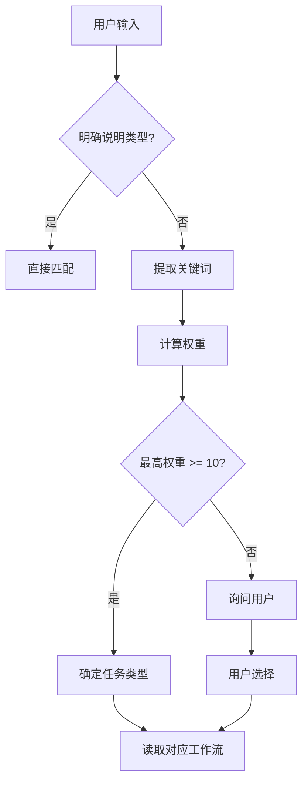

# 任务识别规则详解

> 本文档详细说明 AI 如何识别用户输入的任务类型

---

## 🎯 识别优先级

### Level 1: 精确匹配（最高优先级）
如果用户明确说明任务类型，直接匹配：
- "这是一个需求" → 需求开发
- "这是一个 Bug" → Bug 修复
- "需要优化性能" → 性能优化

### Level 2: 关键词匹配
根据关键词权重计算：

#### 需求开发关键词（权重表）
| 关键词 | 权重 | 示例 |
|--------|------|------|
| 实现、开发、添加 | 10 | "实现用户注册功能" |
| 集成、对接、接入 | 10 | "集成第三方支付" |
| 新功能、新特性 | 9 | "添加新功能" |
| 支持、扩展 | 8 | "支持多语言" |

#### Bug 修复关键词（权重表）
| 关键词 | 权重 | 示例 |
|--------|------|------|
| 修复、解决 | 10 | "修复登录问题" |
| Bug、问题、错误 | 10 | "有个 Bug 需要处理" |
| 报错、异常、崩溃 | 9 | "接口报错" |
| 不工作、失败 | 8 | "支付不工作" |

#### 性能优化关键词（权重表）
| 关键词 | 权重 | 示例 |
|--------|------|------|
| 优化、提升、加速 | 10 | "优化查询速度" |
| 慢、卡顿、延迟 | 10 | "接口太慢了" |
| 性能、效率 | 9 | "提升性能" |
| 降低、减少（资源） | 8 | "降低内存占用" |

---

## 🔍 模糊场景判断规则

### 场景 1: 同时包含多个关键词
```
用户输入: "修复支付接口的性能问题"
关键词: 修复(Bug) + 性能(优化)

判断逻辑:
1. 计算权重: Bug=10, 优化=10
2. 看上下文: "修复...问题" → Bug 修复优先
3. 最终判断: Bug 修复
```

### 场景 2: 关键词不明确
```
用户输入: "用户登录有点慢"
关键词: 慢(优化=10)

判断逻辑:
1. 没有明确说"Bug"或"需求"
2. "慢"是性能问题的直接表述
3. 最终判断: 性能优化
```

### 场景 3: 系统对接场景
```
用户输入: "对接第三方支付 API"
关键词: 对接(需求=10)

判断逻辑:
1. "对接"属于需求开发的子场景
2. 不是独立任务类型
3. 最终判断: 需求开发（会生成对接文档）
```

---

## 🚨 边缘情况处理

### 情况 1: 无法判断
如果无法确定任务类型：
```
AI 输出:
"我不确定这是哪种任务类型，请明确说明：
- 🎯 需求开发 - 新功能或集成
- 🐛 Bug 修复 - 修复问题
- ⚡ 性能优化 - 提升性能
- 📋 技术调研 - 技术选型
- 其他（请描述）"
```

### 情况 2: 多任务组合
如果用户一次提出多个任务：
```
用户: "实现限流功能，并修复登录 Bug"

AI 输出:
"检测到 2 个任务：
1. 需求开发: 实现限流功能
2. Bug 修复: 修复登录 Bug

我将按顺序处理，请确认优先级。"
```

### 情况 3: 任务类型转换
如果任务执行中发现类型错误：
```
初始判断: 需求开发
执行过程中: 发现是已有功能的 Bug

AI 行为:
1. 向用户报告: "这似乎是 Bug 修复而非新需求"
2. 确认后切换到 Bug 修复工作流
3. 重新生成文档
```

---

## 📊 决策树算法



---

## 🧪 测试用例

### 用例 1: 需求开发
```
输入: "在 user 服务添加限流中间件"
期望: 需求开发 → 01-requirement-dev
实际: ✅ 正确识别
```

### 用例 2: Bug 修复
```
输入: "登录接口返回 500 错误"
期望: Bug 修复 → 02-bug-fix
实际: ✅ 正确识别
```

### 用例 3: 性能优化
```
输入: "查询用户列表太慢，需要优化"
期望: 性能优化 → 03-optimization
实际: ✅ 正确识别
```

### 用例 4: 系统对接（边缘情况）
```
输入: "对接微信支付 API"
期望: 需求开发（含对接文档）→ 01-requirement-dev
实际: ✅ 正确识别
```

### 用例 5: 模糊输入
```
输入: "用户认证有问题"
分析: "问题"可能是 Bug 或需求不明确
期望: 询问用户具体情况
实际: ✅ 正确处理
```

---

## 🔧 AI 实现参考

```typescript
interface TaskIdentification {
  type: 'requirement' | 'bug' | 'optimization' | 'research' | 'refactoring' | 'database' | 'security' | 'incident';
  confidence: number; // 0-100
  keywords: string[];
  workflow: string;
}

function identifyTask(userInput: string): TaskIdentification {
  const keywords = extractKeywords(userInput);
  const weights = calculateWeights(keywords);
  const maxWeight = Math.max(...Object.values(weights));
  
  if (maxWeight >= 10) {
    const type = getTaskTypeByMaxWeight(weights);
    return {
      type,
      confidence: Math.min(maxWeight * 10, 100),
      keywords,
      workflow: getWorkflowPath(type)
    };
  }
  
  // 无法确定，需要询问用户
  return null;
}
```

---

## 📝 识别日志模板

AI 识别任务后应输出：
```
✅ 任务识别完成

任务类型: 需求开发
工作流文件: workflows/01-requirement-dev/README.md
置信度: 95%
关键词: ["实现", "限流", "集成"]

下一步: 读取需求开发工作流并执行...
```
